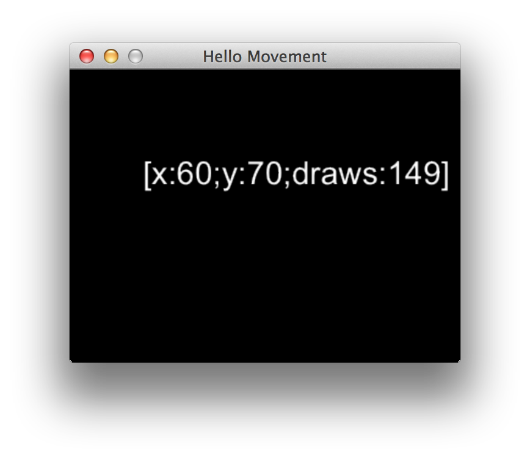
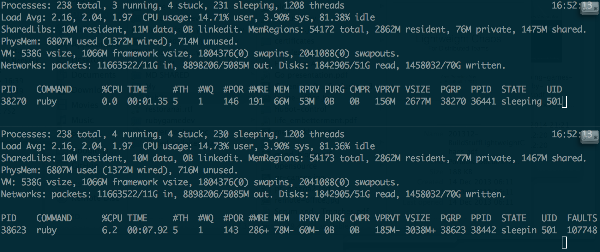

# Gosu Basics

By now Gosu should be installed and ready for a spin. But before we rush into building our game, we
have to get acquainted with our library. We will go through several simple examples, familiarize
ourselves with Gosu architecture and core principles, and take a couple of baby steps towards
understanding how to put everything together.

To make this chapter easier to read and understand, I recommend watching
[Writing Games With Ruby](http://www.confreaks.com/videos/3049-larubyconf2014-writing-games-with-ruby)
talk given by [Mike Moore](http://blowmage.com/) at LA Ruby Conference 2014. In fact, this talk
pushed me towards rethinking this crazy idea of using Ruby for game development, so this book
wouldn't exist without it. Thank you, Mike.

## Hello World

To honor the traditions, we will start by writing "Hello World" to get a taste of what Gosu feels
like. It is based on [Ruby Tutorial](https://github.com/jlnr/gosu/wiki/Ruby-Tutorial) that you can
find in [Gosu Wiki](https://github.com/jlnr/gosu/wiki).

<<[01-hello/hello_world.rb](code/01-hello/hello_world.rb)

Run the code:

{lang="console",line-numbers="off"}
~~~~~~~~
$ ruby 01-hello/hello_world.rb
~~~~~~~~

You should see a neat small window with your message:

See how easy that was? Now let's try to understand what just happened here.

We have extended [`Gosu::Window`](http://www.libgosu.org/rdoc/Gosu/Window.html) with our own
`GameWindow` class, initializing it as `320x240` window. `super` passed `width`, `height` and
`fullscreen` initialization parameters from `GameWindow` to `Gosu::Window`.

Then we defined our window's
[`caption`](http://www.libgosu.org/rdoc/Gosu/Window.html#caption-instance_method), and created
`@message` instance variable with an image generated from text `"Hello, World!"` using
[`Gosu::Image.from_text`](http://www.libgosu.org/rdoc/Gosu/Image.html#from_text-class_method).

We have overridden
[`Gosu::Window#draw`](http://www.libgosu.org/rdoc/Gosu/Window.html#draw-instance_method) instance
method that gets called every time Gosu wants to redraw our game window. In that method we call
[`draw`](http://www.libgosu.org/rdoc/Gosu/Image.html#draw-instance_method) on our
`@message` variable, providing `x` and `y` screen coordinates both equal to `10`, and `z` (depth)
value equal to 0.

## Screen Coordinates And Depth

Just like most conventional computer graphics libraries, Gosu treats `x` as horizontal axis (left to
right), `y` as vertical axis (top to bottom), and `z` as order.

`x` and `y` are measured in pixels, and value of `z` is a relative number that doesn't mean
anything on it's own. The pixel in top-left corner of the screen has coordinates of `0:0`.

`z` order in Gosu is just like `z-index` in CSS. It does not define zoom level, but
in case two shapes overlap, one with higher `z` value will be drawn on top.

## Main Loop

The heart of Gosu library is the [main loop](https://github.com/jlnr/gosu/wiki/Window-Main-Loop)
that happens in [`Gosu::Window`](http://www.libgosu.org/rdoc/Gosu/Window.html).

TODO write more about main loop

## Moving Things With Keyboard

We will modify our "Hello, World!" example to learn how to move things on screen. The following
code will print coordinates of the message along with number of times screen was redrawn. It also
allows exiting the program by hitting Esc button.

<<[01-hello/hello_movement.rb](code/01-hello/hello_movement.rb)

Run the program and try pressing arrow keys:

{lang="console",line-numbers="off"}
~~~~~~~~
$ ruby 01-hello/hello_movement.rb
~~~~~~~~

The message will move around as long as you keep arrow keys pressed.

We could write a shorter version, but the point here is that if we wouldn't override
[`needs_redraw?`](http://www.libgosu.org/rdoc/Gosu/Window.html#needs_redraw%3F-instance_method)
this program would be slower by order of magnitude, because it would create `@message` object every
time it wants to redraw the window, even though nothing would change.

Here is a screenshot of `top` displaying two versions of this program. Second screen has
`needs_redraw?` method removed. See the difference?

Ruby is slow, so you have to use it wisely.
