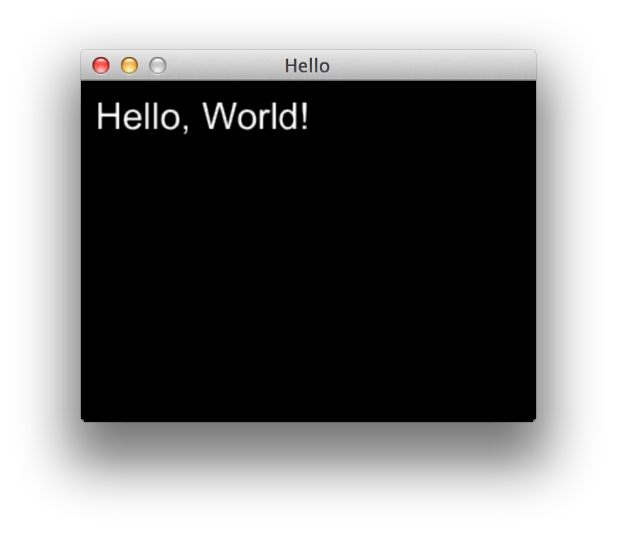

# Gosu Basics

By now Gosu should be installed and ready for a spin. But before we rush into building our game, we
have to get acquainted with our library. We will go through several simple examples, familiarize
ourselves with Gosu architecture and core principles, and take a couple of baby steps towards
understanding how to put everything together.

To make this chapter easier to read and understand, I recommend watching
[Writing Games With Ruby](http://www.confreaks.com/videos/3049-larubyconf2014-writing-games-with-ruby)
talk given by [Mike Moore](http://blowmage.com/) at LA Ruby Conference 2014. In fact, this talk
pushed me towards rethinking this crazy idea of using Ruby for game development, so this book
wouldn't exist without it. Thank you, Mike.

## Hello World

To honor the traditions, we will start by writing "Hello World" to get a taste of what Gosu feels
like. It is based on [Ruby Tutorial](https://github.com/jlnr/gosu/wiki/Ruby-Tutorial) that you can
find in [Gosu Wiki](https://github.com/jlnr/gosu/wiki).

<<[01-hello/hello_world.rb](code/01-hello/hello_world.rb)

Run the code:

{lang="console",line-numbers="off"}
~~~~~~~~
$ ruby 01-hello/hello_world.rb
~~~~~~~~

You should see a neat small window with your message:

See how easy that was? Now let's try to understand what just happened here.

## Main Loop

The heart of Gosu library is the [main loop](https://github.com/jlnr/gosu/wiki/Window-Main-Loop)
that happens in [Gosu::Window](http://www.libgosu.org/rdoc/Gosu/Window.html).

TO BE CONTINUED
