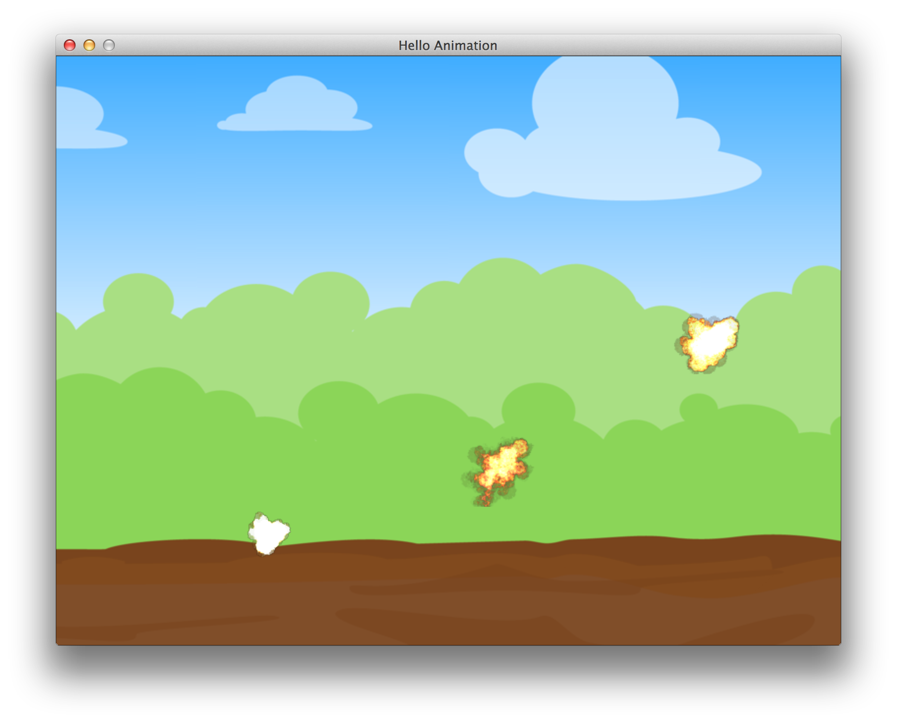

## Images And Animation

It's time to make something more exciting. Our game will have to have explosions, therefore we need
to learn to animate them. We will set up a background scene and trigger explosions on top of it
with our mouse.

<<[01-hello/hello_animation.rb](code/01-hello/hello_animation.rb)

Run it and click around to enjoy those beautiful special effects:

{lang="console",line-numbers="off"}
~~~~~~~~
$ ruby 01-hello/hello_animation.rb
~~~~~~~~

Now let's figure out how it works. Our `GameWindow` initializes with `@background`
[`Gosu::Image`](http://www.libgosu.org/rdoc/Gosu/Image.html) and `@animation`, that holds array
of [`Gosu::Image`](http://www.libgosu.org/rdoc/Gosu/Image.html) instances, one for each frame of explosion.
[`Gosu::Image.load_tiles`](http://www.libgosu.org/rdoc/Gosu/Image.html#load_tiles-class_method)
handles it for us.

`Explosion::SPRITE` points to "tileset" image, which is just a regular image that contains equally
sized smaller image frames arranged in ordered sequence. Rows of frames are read left to right,
like you would read a book.

Given that `explosion.png` tileset is `1024x1024` pixels big, and it has 8 rows of 8 tiles per row,
it is easy to tell that there are 64 tiles `128x128` pixels each. So, `@animation[0]` holds
`128x128` [`Gosu::Image`](http://www.libgosu.org/rdoc/Gosu/Image.html) with top-left tile, and
`@animation[63]` - the bottom-right one.

Gosu doesn't handle animation, it's something you have full control over. We have to draw each tile
in a sequence ourselves. The logic behind this is pretty simple:

1. `Explosion` knows it's `@current_frame` number. It begins with 0.
2. `Explosion#frame_expired?` checks the last time when `@current_frame` was rendered, and when it
is older than `Explosion::FRAME_DELAY` milliseconds, `@current_frame` is increased.
2.  When [`GameWindow#update`](http://www.libgosu.org/rdoc/Gosu/Window.html#update-instance_method)
is called, `@current_frame` is recalculated for all `@explosions`. Also, explosions that have
finished their animation (displayed the last frame) are removed from `@explosions` array.
3. [`GameWindow#draw`](http://www.libgosu.org/rdoc/Gosu/Window.html#draw-instance_method) draws
background image and all `@explosions` draw their `current_frame`.
4. Again, we are saving resources and not redrawing when there are no `@explosions` in progress.
`needs_redraw?` handles it.

It is important to understand that `update` and `draw` order is unpredictable, these methods can be
called by your system at different rate, you can't tell which one will be called more often than
the other one, so `update` should only be concerned with advancing object state, and `draw` should
only draw current state on screen if it is needed.

Rule of the thumb: `draw` should be as lightweight as possible. Prepare all calculations in
`update` and you will have responsive, smooth graphics.
