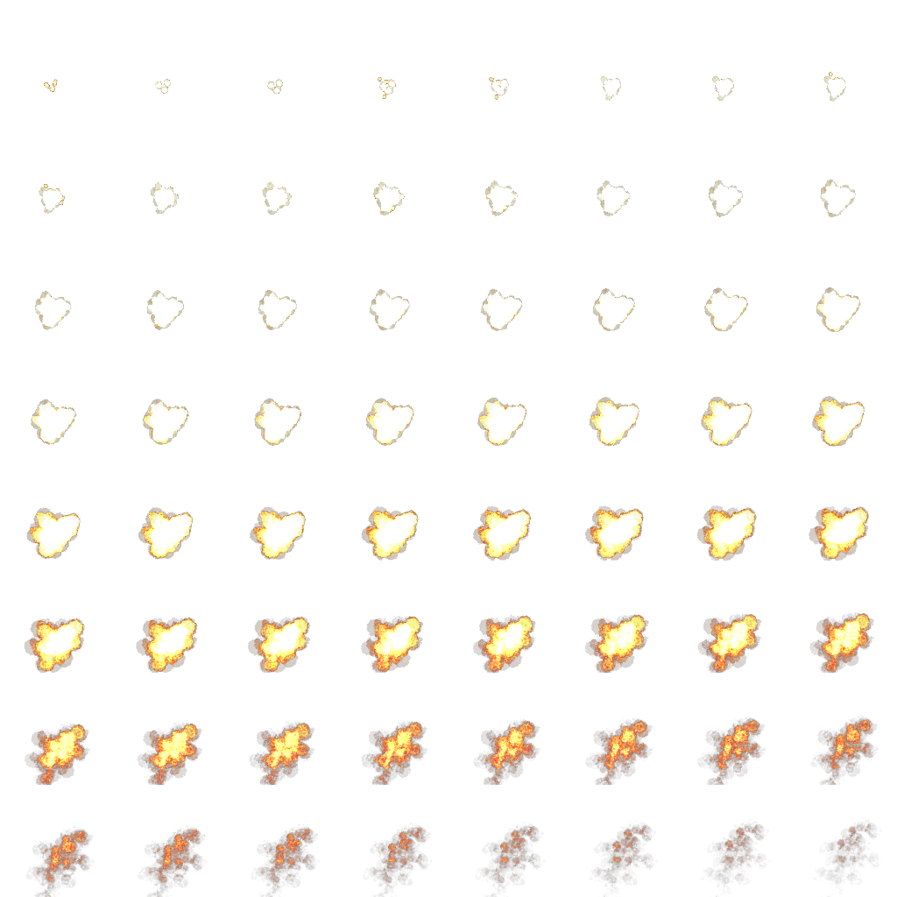

## Basic Animation

It's time to make something more exciting. Our game will have to have explosions, therefore we need
to learn to animate them. We will set up a background scene and trigger explosions on top of it
with our mouse.

<<[01-hello/hello_animation.rb](code/01-hello/hello_animation.rb)

Run it and click around to enjoy those beautiful special effects:

{lang="console",line-numbers="off"}
~~~~~~~~
$ ruby 01-hello/hello_animation.rb
~~~~~~~~

Now let's figure out how it works. Our `GameWindow` initializes with `@background`
[`Gosu::Image`](http://www.libgosu.org/rdoc/Gosu/Image.html) and `@animation`, that holds array
of `Gosu::Image` instances, one for each frame of explosion.
[`Gosu::Image.load_tiles`](http://www.libgosu.org/rdoc/Gosu/Image.html#load_tiles-class_method)
handles it for us.

`Explosion::SPRITE` points to "tileset" image, which is just a regular image that contains equally
sized smaller image frames arranged in ordered sequence. Rows of frames are read left to right,
like you would read a book.

