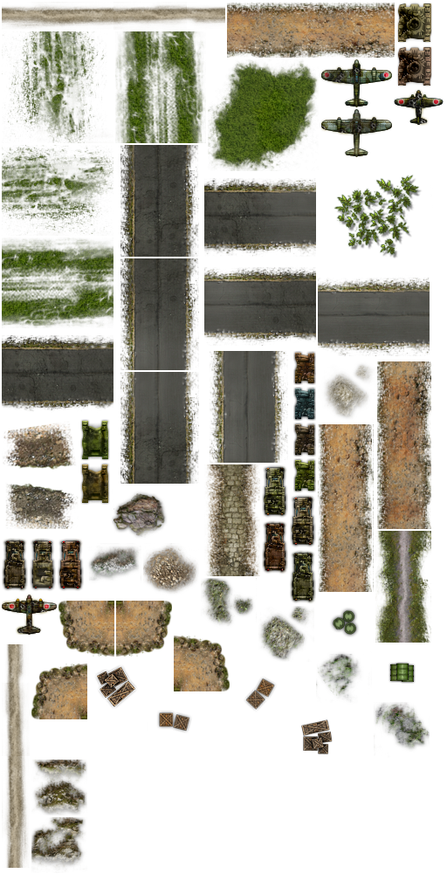
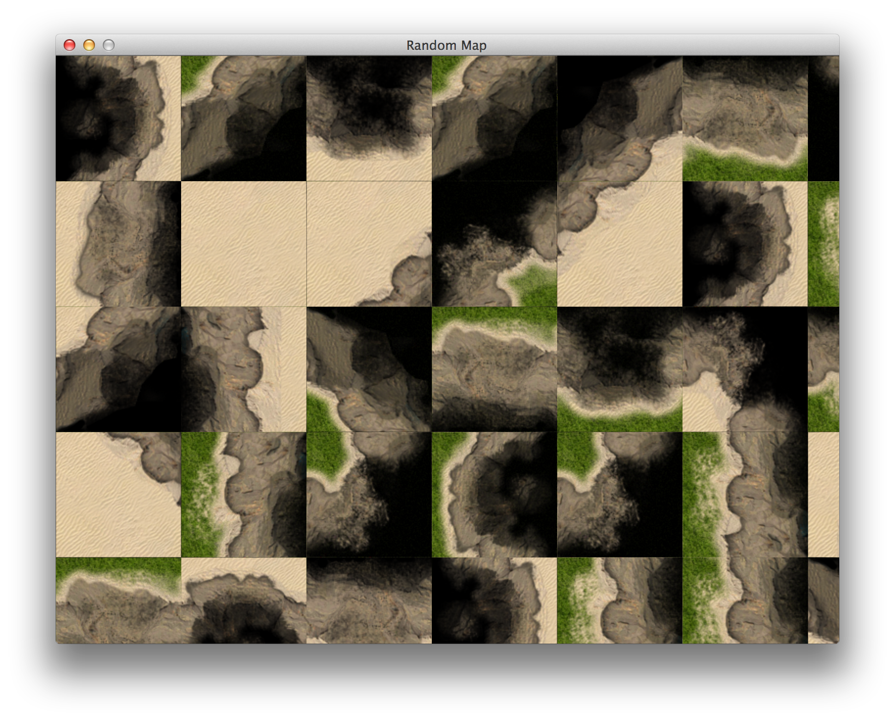
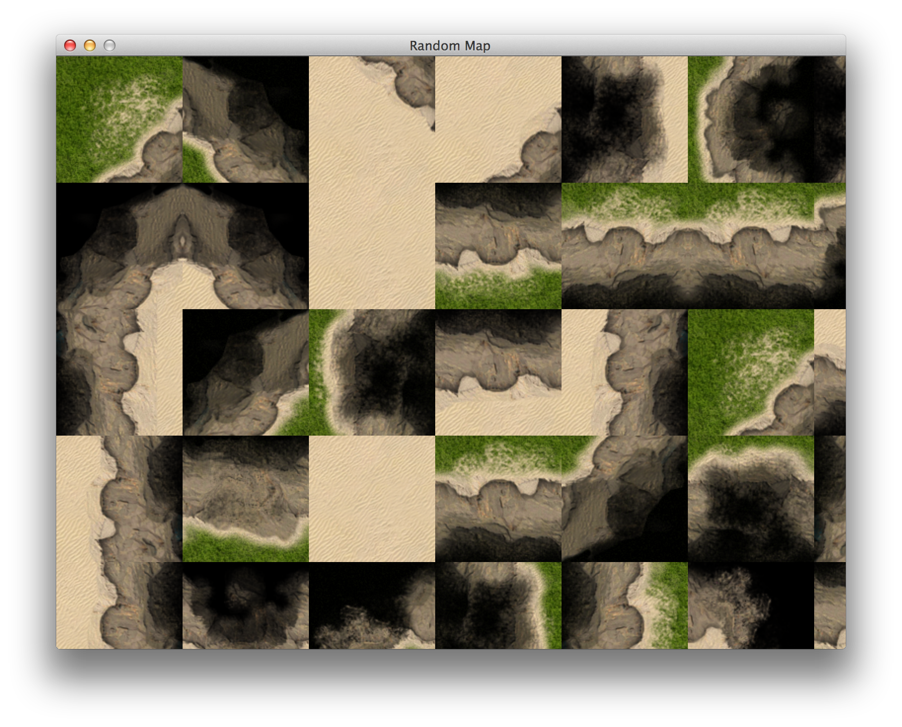
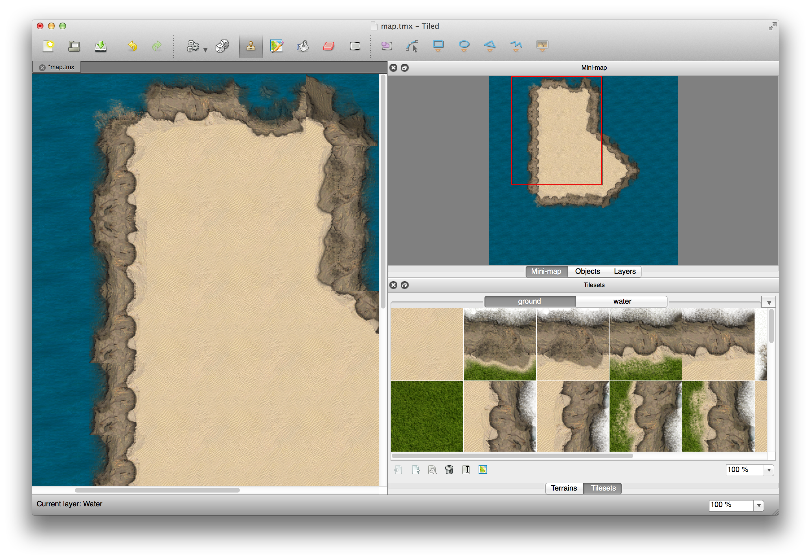
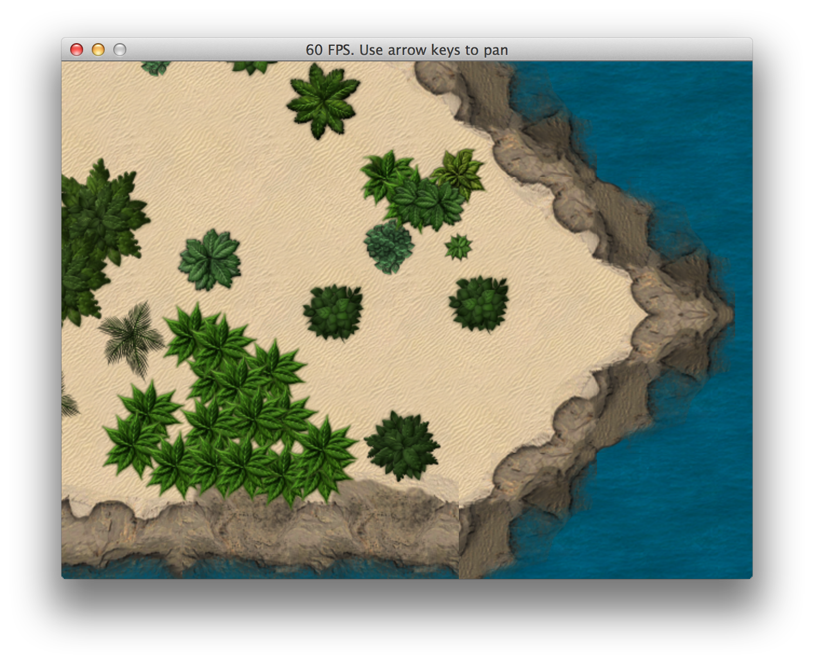
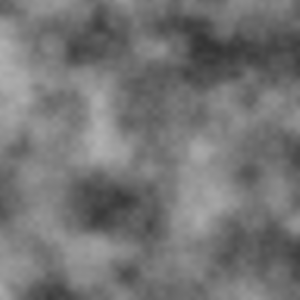
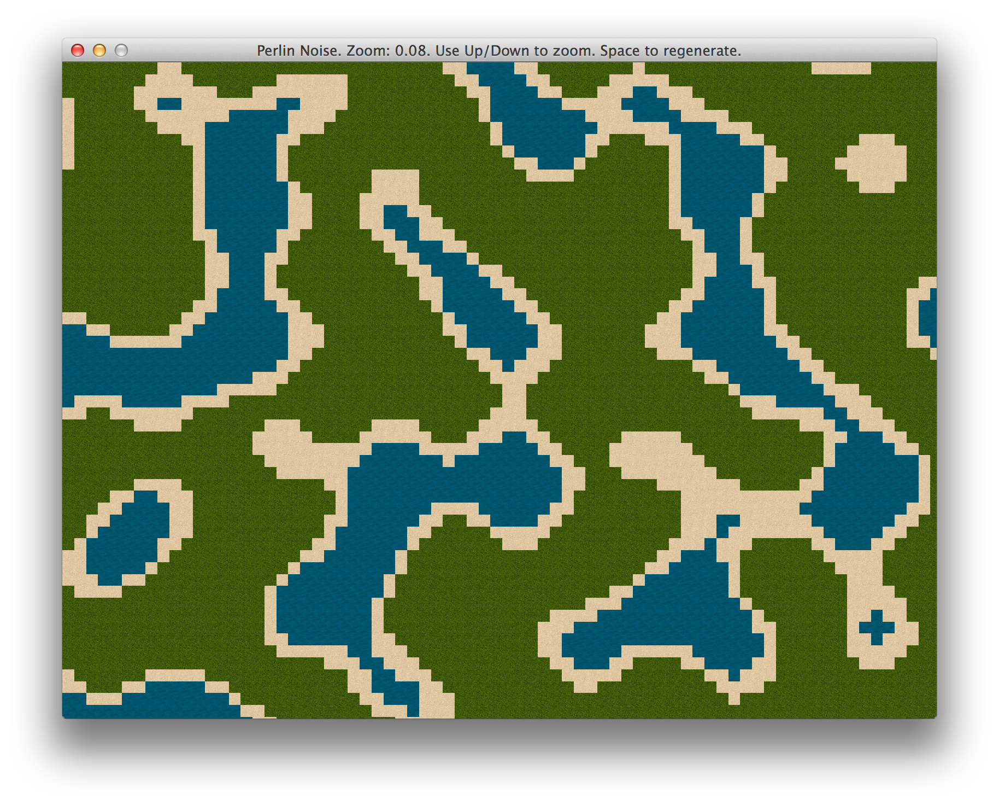
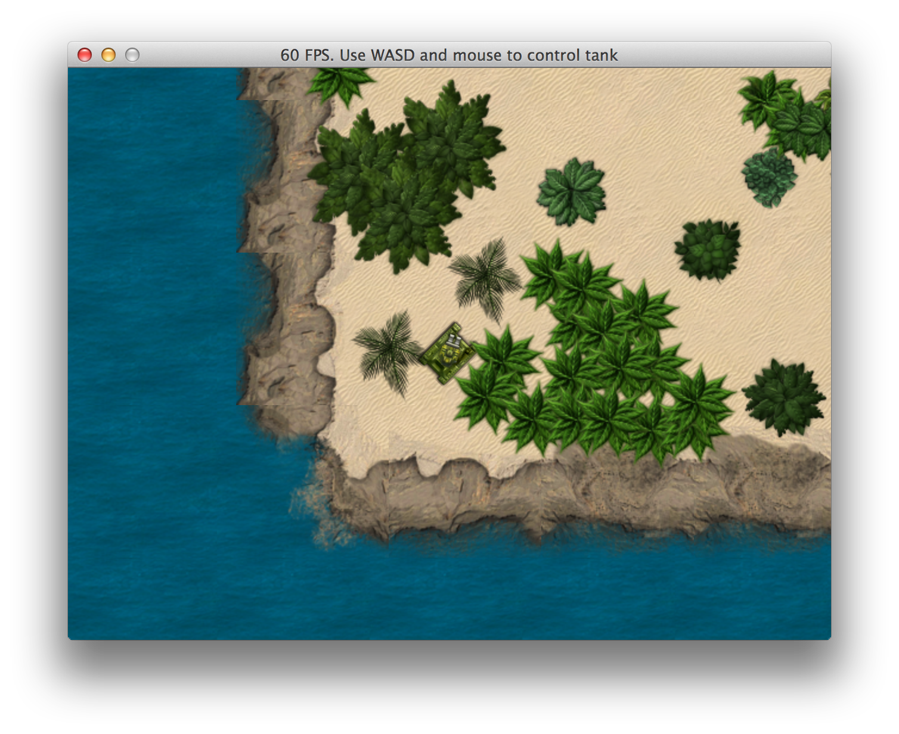

# Warming Up

Before we start building our game, we want to flex our skills little more, get to know Gosu better
and make sure our tools will be able to meet our expectations.

## Using Tilesets

After playing around with Gosu for a while, we should be comfortable enough to implement a
prototype of top-down view game map using the tileset of our choice. This [ground
tileset](http://opengameart.org/content/ground-tileset-grass-sand) looks like a good place to
start.

## Integrating With Texture Packer

After downloading and extracting the tileset, it's obvious that
[`Gosu::Image#load_tiles`](http://www.libgosu.org/rdoc/Gosu/Image.html#load_tiles-class_method)
will not suffice, since it only supports tiles of same size, and there is a tileset in the package
that looks like this:

And there is also a JSON file that contains some metadata:

{lang="json",line-numbers="off"}
~~~~~~~~
{"frames": {
"aircraft_1d_destroyed.png":
{
  "frame": {"x":451,"y":102,"w":57,"h":42},
  "rotated": false,
  "trimmed": false,
  "spriteSourceSize": {"x":0,"y":0,"w":57,"h":42},
  "sourceSize": {"w":57,"h":42}
},
"aircraft_2d_destroyed.png":
{
  "frame": {"x":2,"y":680,"w":63,"h":47},
  "rotated": false,
  "trimmed": false,
  "spriteSourceSize": {"x":0,"y":0,"w":63,"h":47},
  "sourceSize": {"w":63,"h":47}
},
...
}},
"meta": {
	"app": "http://www.texturepacker.com",
	"version": "1.0",
	"image": "decor.png",
	"format": "RGBA8888",
	"size": {"w":512,"h":1024},
	"scale": "1",
	"smartupdate": "$TexturePacker:SmartUpdate:2e6b6964f24c7abfaa85a804e2dc1b05$"
}
~~~~~~~~

Looks like these tiles were packed with [Texture Packer](http://www.texturepacker.com). After some
digging I've discovered that Gosu doesn't have any integration with it, so I had these choices:

1. Cut the original tileset image into smaller images.
2. Parse JSON and harness the benefits of Texture Packer.

First option was too much work and would prove to be less efficient, because loading many small
files is always worse than loading one bigger file. Therefore, second option was the winner, and I
also thought "why not write a gem while I'm at it". And that's exactly what I did, and you should
do the same in such a situation. The gem is available on GitHub:

[https://github.com/spajus/gosu-texture-packer](https://github.com/spajus/gosu-texture-packer)

You can install this gem using `gem install gosu_texture_packer`. If you want to examine the code,
easiest way is to clone it on your computer:

{lang="console",line-numbers="off"}
~~~~~~~~
$ git clone
~~~~~~~~

Let's examine the main idea behind this gem. Here is a slightly simplified version that does
handles everything in under 20 lines of code:

<<[02-warmup/tileset.rb](code/02-warmup/tileset.rb)

If by now you are familiar with [Gosu documentation](http://www.libgosu.org/rdoc/), you will wonder
what the hell is
[`Gosu::Image#subimage`](https://github.com/jlnr/gosu/blob/0c1a155dcb9034b345d7cfe41b0b86f39f57f540/ext/gosu/gosu.swg#L553-L558). At the point of writing it was not documented, and I
accidentally [discovered
it](https://github.com/jlnr/gosu/blob/master/feature_tests/image_subimage.rb#L25) while digging
through Gosu source code.

I'm lucky this function existed, because I was ready to bring out the heavy artillery and use
[RMagick](https://github.com/rmagick/rmagick) to extract those tiles. We will probably need RMagick
at some point of time later, but it's better to avoid dependencies as long as possible.

## Combining Tiles Into A Map

With tileset loading issue out of the way, we can finally get back to drawing that cool map of
ours.

The following program will fill the screen with random tiles.

<<[02-warmup/random_map.rb](code/02-warmup/random_map.rb)

Run it, then press spacebar to refill the screen with random tiles.

{lang="console",line-numbers="off"}
~~~~~~~~
$ ruby 02-warmup/random_map.rb
~~~~~~~~

The result doesn't look seamless, so we will have to figure out what's wrong. After playing around
for a while, I've noticed that it's an issue with `Gosu::Image`.

When you load a tile like this, it works perfectly:

{line-numbers="off"}
~~~~~~~~
Gosu::Image.new(self, image_path, true, 0, 0, 128, 128)
Gosu::Image.load_tiles(self, image_path, 128, 128, true)
~~~~~~~~

And the following produces so called "texture bleeding":

{line-numbers="off"}
~~~~~~~~
Gosu::Image.new(self, image_path, true)
Gosu::Image.new(self, image_path, true).subimage(0, 0, 128, 128)
~~~~~~~~

Good thing we're not building our game yet, right? Welcome to the intricacies of software
development!

Now, I [have reported my findings](https://github.com/jlnr/gosu/issues/227), but until it gets
fixed, we need a workaround. And the workaround was to use RMagick. I knew we won't get too far
away from it. But our random map now looks gorgeous:

## Using Tiled To Create Maps

While low level approach to drawing tiles in screen may be appropriate in some scenarios, like
randomly generated maps, we will explore another alternatives. One of them is this great, open
source, cross platform, generic tile map editor called [Tiled](http://www.mapeditor.org/).

It has some limitations, for instance, all tiles in tileset have to be of same proportions. On the
upside, it would be easy to load Tiled tilesets with
[`Gosu::Image#load_tiles`](http://www.libgosu.org/rdoc/Gosu/Image.html#load_tiles-class_method).

Tiled uses it's own custom, XML based `tmx` format for saving maps. It also allows exporting maps
to JSON, which is way more convenient, since parsing XML in Ruby is usually done with
[Nokogiri](http://nokogiri.org/), which is heavier and it's native extensions usually cause more
trouble than ones JSON parser uses. So, let's see how that JSON looks like:

{lang="json"}
<<[02-warmup/tiled_map.json](code/02-warmup/tiled_map.json)

There are following things listed here:

- Two different tilesets, "ground" and "water"
- Map width and height in tile count (10x10)
- Layers with data array contains tile numbers

Couple of extra things that Tiled maps can have:

- Object layers containing lists of objects with their coordinates
- Properties hash on tiles and objects

This doesn't look too difficult to parse, so we're going to implement a loader for Tiled maps.
And make it open source, of course.

## Loading Tiled Maps With Gosu

Probably the easiest way to load Tiled map is to take each layer and render it on screen, tile by
tile, like a cake. We will not care about caching at this point, and the only optimization would be
not drawing things that are out of screen boundaries.

After couple of days of test driven development, I've ended up writing
[gosu_tiled](https://github.com/spajus/gosu-tiled) gem, that allows you to load Tiled maps with
just a few lines of code.

I will not go through describing the implementation, but if you want to examine the thought
process, take a look at `gosu_tiled` gem's
[git commit history](https://github.com/spajus/gosu-tiled/commits/master).

To use the gem, do `gem install gosu_tiled` and examine the code that shows a map of the island
that you can scroll around with arrow keys:

<<[02-warmup/island.rb](code/02-warmup/island.rb)

Run it, use arrow keys to scroll the map.

{lang="console",line-numbers="off"}
~~~~~~~~
$ ruby 02-warmup/island.rb
~~~~~~~~

The result is quite satisfying, and it scrolls smoothly without any optimizations:

## Generating Random Map With Perlin Noise

In some cases random generated maps make all the difference. Worms and Diablo would probably be
just average games if it wasn't for those always unique, procedurally generated maps.

We will try to make a very primitive map generator ourselves.  To begin with, we will be using only
3 different tiles - water, sand and grass. For implementing fully tiled edges, the generator must
be aware of available tilesets and know how to combine them in valid ways. We may come back to
it, but for now let's keep things simple.

Now, generating naturally looking randomness is something worth having a book of it's own, so
instead of trying to poorly reinvent what other people have already done, we will use a well known
algorithm perfectly suited for this task -
[Perlin noise](http://en.wikipedia.org/wiki/Perlin_noise).

If you have ever used Photoshop's Cloud filter, you already know how Perlin noise looks like:

Now, we could implement the algorithm ourselves, but there is
[perlin_noise](https://github.com/junegunn/perlin_noise) gem already available, it looks pretty
solid, so we will use it.

The following program generates `100x100` map with 30% chance of water, 15% chance of sand and 55%
chance of grass:

<<[02-warmup/perlin_noise_map.rb](code/02-warmup/perlin_noise_map.rb)

Run the program, zoom with up / down arrows and regenerate everything with spacebar.

{lang="console",line-numbers="off"}
~~~~~~~~
$ ruby 02-warmup/perlin_noise_map.rb
~~~~~~~~

This is a little longer than our previous examples, so we will analyze some parts to make it clear.

{starting-line-number=81}
~~~~~~~~
def generate_map
  noises = Perlin::Noise.new(2)
  contrast = Perlin::Curve.contrast(
    Perlin::Curve::CUBIC, 2)
  map = {}
  MAP_WIDTH.times do |x|
    map[x] = {}
    MAP_HEIGHT.times do |y|
      n = noises[x * 0.1, y * 0.1]
      n = contrast.call(n)
      map[x][y] = choose_tile(n)
    end
  end
  map
end
~~~~~~~~

`generate_map` is the heart of this program. It creates two dimensional `Perlin::Noise` generator,
then chooses a random tile for each location of the map, according to noise value. To make the map
a little sharper, cubic contrast is applied to noise value before choosing the tile. Try commenting
out contrast application - it will look like a boring golf course, since noise values will keep
buzzing around the middle.

{starting-line-number=97}
~~~~~~~~
def choose_tile(val)
  case val
  when 0.0..0.3 # 30% chance
    @water
  when 0.3..0.45 # 15% chance, water edges
    @sand
  else # 55% chance
    @grass
  end
end
~~~~~~~~

Here we could go crazy if we had more different tiles to use. We could add deep waters at
`0.0..0.1`, mountains at `0.9..0.95` and snow caps at `0.95..1.0`. And all this would have
beautiful transitions.

## Player Movement With Keyboard And Mouse

We have learned to draw maps, but we need a protagonist to explore them. It will be a tank that you
can move around the island with WASD keys and use your mouse to target it's gun at things. The tank
will be drawn on top of our island map, and it will be above ground, but below tree layer, so it
can sneak behind palm trees. That's as close to real deal as it gets!

<<[02-warmup/player_movement.rb](code/02-warmup/player_movement.rb)

Run it and stroll around the island. You can still move on water and into the darkness, away from
the map itself, but we will handle it later.

{lang="console",line-numbers="off"}
~~~~~~~~
$ ruby 02-warmup/player_movement.rb
~~~~~~~~

See that tank hiding between the bushes, ready to go in 8 directions and blow shit up with that
precisely aimed double cannon?

