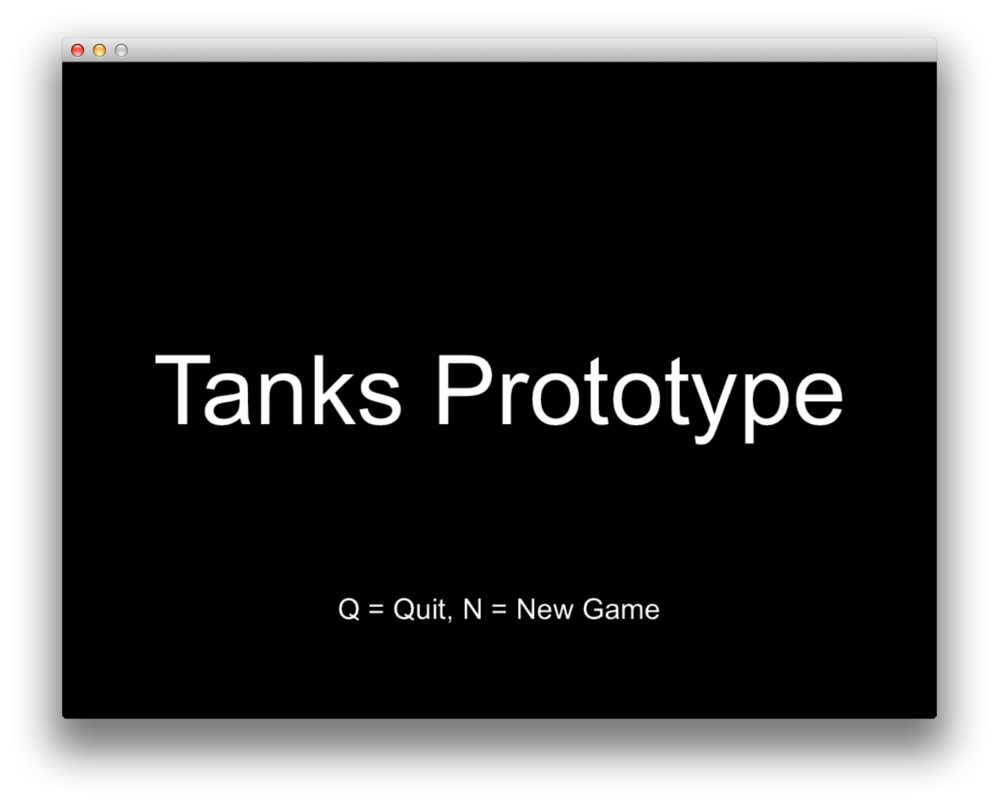
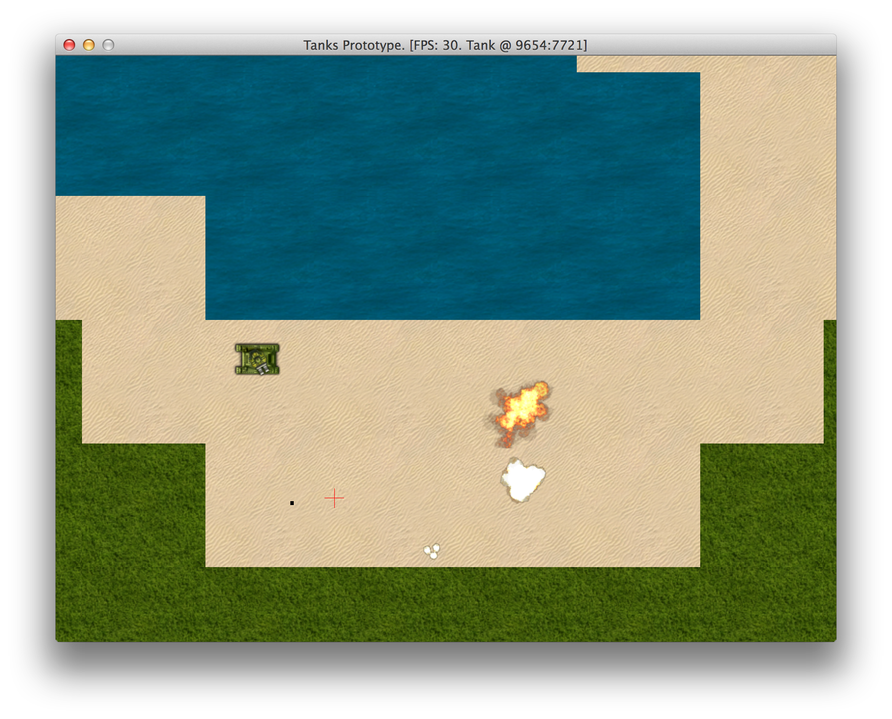

# Prototyping The Game

Warming up was really important, but let's combine everything we learned, add some new challenges,
and build a small prototype with following features:

1. Camera loosely follows tank.
2. Camera zooms automatically depending on tank speed.
3. You can temporarily override automatic camera zoom using keyboard.
4. Music and sound effects.
5. Randomly generated map.
6. Two modes: menu and gameplay.
7. Tank movement with WADS keys.
8. Tank aiming and shooting with mouse.
9. Collision detection (tanks don't swim).
10. Explosions, visible bullet trajectories.
11. Bullet range limiting.

Sounds fun? Hell yes! However, before we start, we should plan ahead a little and think how our
game architecture will look like. We will also structure our code a little, so it will not be
smashed into one ruby class, as we did in earlier examples. Books should show good manners!

## Switching Between Game States

First, let's think how to hook into
[`Gosu::Window`](http://www.libgosu.org/rdoc/Gosu/Window.html). Since we will have two game
states, [State pattern](http://en.wikipedia.org/wiki/State_pattern) naturally comes to mind.

So, our `GameWindow` class could look like this:

<<[03-prototype/game_window.rb](code/03-prototype/game_window.rb)

It has current `@state`, and all usual main loop actions are executed on that state instance.
We will add base class that all game states will extend. Let's name it `GameState`:

<<[03-prototype/states/game_state.rb](code/03-prototype/states/game_state.rb)

This class provides `GameState.switch`, that will change the state for our `Gosu::Window`, and all
`enter` and `leave` methods when appropriate. These methods will be useful for things like
switching music.

Notice that `Gosu::Window` is accessed using global `$window` variable, which will be considered an
anti-pattern by most good programmers, but there is some logic behind this:

1. There will be only one `Gosu::Window` instance.
2. It lives as long as the game runs.
3. It is used in some way by nearly all other classes, so we would have to pass it around all the
time.
4. Accessing it using Singleton or static utility class would not give any clear benefits, just add more complexity.

[Chingu](https://github.com/ippa/chingu), another game framework built on top of Gosu, also uses
global `$window`, so it's probably not the worst idea ever.

We will also need an entry point that would fire up the game and enter the first game state - the
menu.

<<[03-prototype/main.rb](code/03-prototype/main.rb)

In our entry point we also have a small helper which will help loading images and sounds using
`Game.media_path`.

The rest is obvious: we create `GameWindow` instance and store it in `$window` variable, as
discussed before. Then we use `GameState.switch)` to load `MenuState`, and show the game window.

## Implementing Menu State

This is how simple `MenuState` implementation looks like:

<<[03-prototype/states/menu_state.rb](code/03-prototype/states/menu_state.rb)

It's a [Singleton](http://www.ruby-doc.org/stdlib-2.1.2/libdoc/singleton/rdoc/Singleton.html), so
we can always get it with `MenuState.instance`.

It starts playing `menu_music.mp3` when you enter the menu, and stop the music when you leave it.
Instance of [`Gosu::Song`](http://www.libgosu.org/rdoc/Gosu/Song.html) is cached in `@@music` class
variable to save resources.

We have to know if play is already in progress, so we can add a possibility to go back to the
game. That's why `MenuState` has `@play_state` variable, and either allows creating new `PlayState`
when `N` key is pressed, or switches to existing `@play_state` if `C` key is pressed.

Here comes the interesting part, implementing the play state.

## Implementing Play State

Before we start implementing actual gameplay, we need to think what game entities we will be
building. We will need a `Map` that will hold our tiles and provide world coordinate system. We
will also need a `Camera` that will know how to float around and zoom. There will be `Bullet`s
flying around, and each bullet will eventually cause an `Explosion`.

Having all that taken care of, `PlayState` should look pretty simple:

<<[03-prototype/states/play_state.rb](code/03-prototype/states/play_state.rb)

Update and draw calls are passed to the underlying game entities, so they can handle them the way
they want it to. Such encapsulation reduces complexity of the code and allows doing every piece of
logic where it belongs, while keeping it short and simple.

There are a few interesting parts in this code. Both `@tank.update` and `@tank.shoot` may produce a
new bullet, if your tank's fire rate is not exceeded, and if left mouse button is kept down, hence
the `update`. If bullet is produced, it is added to `@bullets` array, and they live their own
little lifecycle, until they explode and are no longer used. `@bullets.reject!(&:done?)` cleans up
the garbage.

`PlayState#draw` deserves extra explanation. `@camera.x` and `@camera.y` points to *game*
coordinates where `Camera` is currently looking at.
[`Gosu::Window#translate`](http://www.libgosu.org/rdoc/Gosu/Window.html#translate-instance_method)
creates a block within which all [`Gosu::Image`](http://www.libgosu.org/rdoc/Gosu/Image.html) draw
operations are translated by given offset.
[`Gosu::Window#scale`](http://www.libgosu.org/rdoc/Gosu/Window.html#scale-instance_method) does the
same with `Camera` zoom.

Crosshair is drawn without translating and scaling it, because it's relative to screen, not to
world map.

Basically, this draw method is the place that takes care drawing only what `@camera` can see.

If it's hard to understand how this works, get back to "Game Coordinate System" chapter and let it
sink in.

## Implementing World Map

We will start analyzing game entities with `Map`.

<<[03-prototype/entities/map.rb](code/03-prototype/entities/map.rb)

This implementation is very similar to the `Map` we had built in "Generating Random Map With
Perlin Noise", with some extra additions. `can_move_to?` verifies if tile under given coordinates
is not water. Pretty simple, but it's enough for our prototype.

Also, when we `draw` the map we have to make sure if tiles we are drawing are currently visible by
our camera, otherwise we will end up drawing off screen. `camera.can_view?` handles it. Current
implementation will probably be causing a bottleneck, since it brute forces through all the map
rather than cherry-picking the visible region. We will probably have to get back and change it
later.

`find_spawn_point` is one more addition. It keeps picking a random point on map and verifies if
it's not water using `can_move_to?`. When solid tile is found, it returns the coordinates, so our
`Tank` will be able to spawn there.

## Implementing Floating Camera

If you played the original [Grand Theft
Auto](http://en.wikipedia.org/wiki/Grand_Theft_Auto_(video_game)) or GTA 2, you should remember how fascinating the
camera was. It backed away when you were driving at high speeds, closed in when you were walking on
foot, and floated around as if a smart drone was following your protagonist from above.

The following `Camera` implementation is far inferior to the one GTA had nearly two decades ago,
but it's a start:

<<[03-prototype/entities/camera.rb](code/03-prototype/entities/camera.rb)

Our `Camera` has `@target` that it tries to follow, `@x` and `@y` that it
currently is looking at, and `@zoom` level.

All the magic happens in `update` method. It keeps track of the distance between `@target` and
adjust itself to stay nearby. And when `@target.speed` shows some movement momentum, camera slowly
backs away.

`Camera` also tels if you `can_view?` an object at some
coordinates, so when other entities draw themselves, they can check if there is a need for that.

Another noteworthy method is `mouse_coords`. It translates mouse position on screen to mouse
position on map, so the game will know where you are targeting your guns.

## Implementing The Tank

Most of our tank code will be taken from "Player Movement With Keyboard And Mouse":

<<[03-prototype/entities/tank.rb](code/03-prototype/entities/tank.rb)

`Tank` has to be aware of the `Map` to check where it's moving, and it uses `Camera` to find out
where to aim the guns. When it `shoot`s, it produces instances of `Bullet`, that are simply
returned to the caller. Tank won't keep track of them, it's "fire and forget".

## Implementing Bullets And Explosions

Bullets will require some simple vector math. You have a point that moves along the vector with
some speed. It also needs to limit the maximum vector length, so if you try to aim too far, the
bullet will only go as far as it can reach.

<<[03-prototype/entities/bullet.rb](code/03-prototype/entities/bullet.rb)

Possibly the most interesting part of `Bullet` implementation is `point_at_distance` method. It
returns coordinates of point that is between bullet source, which is point that bullet was fired
from, and it's target, which is the destination point. The returned point is as far away from
source point as `distance` tells it to.

After bullet has done flying, it explodes with fanfare. In our prototype `Explosion` is a part of
`Bullet`, because it's the only thing that triggers it. Therefore `Bullet` has two stages of it's
lifecycle. First it flies towards the target, then it's exploding. That brings us to `Explosion`:

<<[03-prototype/entities/explosion.rb](code/03-prototype/entities/explosion.rb)

There is nothing fancy about this implementation. Most of it is taken from "Images And Animation"
chapter.

## Running The Prototype

We have walked through all the code. You can get it
[at GitHub](https://github.com/spajus/ruby-gamedev-book-examples/tree/master/03-prototype).

Now it's time to give it a spin. There is [a video of me playing
it](https://www.youtube.com/watch?v=ZP5y63JIXfc) available on YouTube, but it's always best to
experience it firsthand. Run `main.rb` to start the game:

{lang="console",line-numbers="off"}
~~~~~~~~
$ ruby 03-prototype/main.rb
~~~~~~~~

Hit `N` to start new game.

Time to go crazy!

One thing should be bugging you at this point. FPS shows only 30, rather than 60. That means our
prototype is slow. We will put it back to 60 FPS in next chapter.
