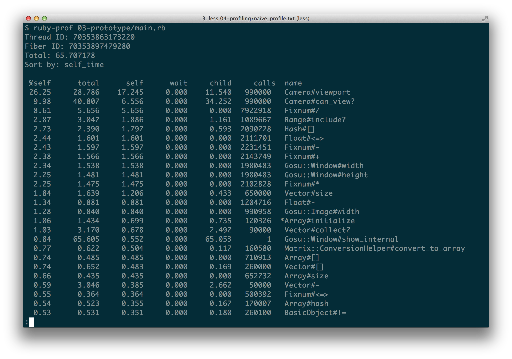

# Optimizing Game Performance

To make games that are fast and don't require a powerhouse to run, we must learn how to find and
fix bottlenecks. Good news is that if you wasn't thinking about performance to begin with, your
program can usually be optimized to run twice as fast just by eliminating one or two biggest
bottlenecks.

We will be using a copy of the prototype code to keep both optimized and original version,
therefore if you are exploring sample code, look at `04-prototype-optimized`.

## Profiling Ruby Code To Find Bottlenecks

We will try to find bottlenecks in our Tanks prototype game by profiling it with
[`ruby-prof`](https://github.com/ruby-prof/ruby-prof).

It's a ruby gem, just install it like this:

{lang="console",line-numbers="off"}
~~~~~~~~
$ gem install ruby-prof
~~~~~~~~

There are several ways you can use `ruby-prof`, so we will begin with the easiest one. Instead of
running the game with `ruby`, we will run it with `ruby-prof`:

{lang="console",line-numbers="off"}
~~~~~~~~
$ ruby-prof 03-prototype/main.rb
~~~~~~~~

The game will run, but everything will be ten times slower as usual, because every call to every
function is being recorded, and after you exit the program, profiling output will be dumped
directly to your console.

Downside of this approach is that we are going to profile everything there is, including the
super-slow map generation that uses Perlin Noise. We don't want to optimize that, so in order to
find bottlenecks in our play state rather than map generation, we have to keep playing at dreadful
2 FPS for at least 30 seconds.

This was the output of first "naive" profiling session:

It's obvious, that `Camera#viewport` and `Camera#can_view?` are top CPU burners. This means either
that our implementation is either very bad, or the assumption that checking if camera can view
object is slower than drawing the object off screen.

Here are those slow methods:

{line-numbers="off"}
~~~~~~~~
class Camera
  # ...
  def can_view?(x, y, obj)
    x0, x1, y0, y1 = viewport
    (x0 - obj.width..x1).include?(x) &&
      (y0 - obj.height..y1).include?(y)
  end
  # ...
  def viewport
    x0 = @x - ($window.width / 2)  / @zoom
    x1 = @x + ($window.width / 2)  / @zoom
    y0 = @y - ($window.height / 2) / @zoom
    y1 = @y + ($window.height / 2) / @zoom
    [x0, x1, y0, y1]
  end
  # ...
end
~~~~~~~~

It doesn't look fundamentally broken, so we will try our "checking is slower than rendering"
hypothesis by short-circuiting `can_view?` to return `true` every time:

{line-numbers="off"}
~~~~~~~~
class Camera
  # ...
  def can_view?(x, y, obj)
    return true # short circuiting
    x0, x1, y0, y1 = viewport
    (x0 - obj.width..x1).include?(x) &&
      (y0 - obj.height..y1).include?(y)
  end
  # ...
end
~~~~~~~~

After saving `camera.rb` and running the game without profiling, you will notice a significant
speedup. Hypothesis was correct, checking visibility is more expensive than simply rendering it.
That means we can throw away `Camera#can_view?` and calls to it.

But before doing that, let's profile once again:

We can see `Camera#can_view?` is still in top 3, so we will remove
`if camera.can_view?(map_x, map_y, tile)` from `Map#draw` and for now keep it like this:

{line-numbers="off"}
~~~~~~~~
class Map
  # ...
  def draw(camera)
    @map.each do |x, row|
      row.each do |y, val|
        tile = @map[x][y]
        map_x = x * TILE_SIZE
        map_y = y * TILE_SIZE
        tile.draw(map_x, map_y, 0)
      end
    end
  end
  # ...
end
~~~~~~~~

After completely removing `Camera#can_view?`, profiling session looks like dead-end - no more low
hanging fruits on top:

The game still doesn't feel fast enough, FPS occasionally keeps dropping down to ~45, so we will
have to do profile our code in smarter way.

## Advanced Profiling Techniques

We would get more accuracy when profiling only what we want to optimize. In our case it is
everything that happens in `PlayState`, except for `Map` generation. This time we will have to use
[`ruby-prof`](https://github.com/ruby-prof/ruby-prof) API to hook into places we need.

`Map` generation happens in `PlayState` initializer, so we will leverage `GameState#enter` and
`GameState#leave` to start and stop profiling, since it happens after state is initialized. Here is
how we hook in:

{line-numbers="off"}
~~~~~~~~
require 'ruby-prof'
class PlayState < GameState
  # ...
  def enter
    RubyProf.start
  end

  def leave
    result = RubyProf.stop
    printer = RubyProf::FlatPrinter.new(result)
    printer.print(STDOUT)
  end
  # ...
end
~~~~~~~~

Then we run the game as usual:

{lang="console",line-numbers="off"}
~~~~~~~~
$ ruby 04-prototype-optimized/main.rb
~~~~~~~~

Now, after we press `N` to start new game, `Map` generation happens relatively fast, and then
profiling kicks in, FPS drops to 15. After moving around and shooting for a while we hit `Esc` to
return to the menu, and at that point `PlayState#leave` spits profiling results out to the console:

We can see that
[`Gosu::Image#draw`](http://www.libgosu.org/rdoc/Gosu/Image.html#draw-instance_method) takes up to
20% of all execution time. Then goes
[`Gosu::Window#caption`](http://www.libgosu.org/rdoc/Gosu/Window.html#caption-instance_method), but
we need it to measure FPS, so we will leave it alone, and finally we can see
[`Hash#each`](http://www.ruby-doc.org/core-2.1.2/Hash.html#method-i-each), which is guaranteed to
be the one from `Map#draw`, and it triggers all those Gosu::Image#draw calls.

## Optimizing Inefficient Code

According to profiling results, we need to optimize this method:

{line-numbers="off"}
~~~~~~~~
class Map
  # ...
  def draw(camera)
    @map.each do |x, row|
      row.each do |y, val|
        tile = @map[x][y]
        map_x = x * TILE_SIZE
        map_y = y * TILE_SIZE
        tile.draw(map_x, map_y, 0)
      end
    end
  end
  # ...
end
~~~~~~~~

But we have to optimize it in more clever way than we did before. If instead of looping through all
map rows and columns and blindly rendering every tile or checking if tile is visible we could
calculate the exact map cells that need to be displayed, we would reduce method complexity
and get major performance boost. Let's do that.

We will use `Camera#viewport` to return map boundaries that are visible by camera, then divide those boundaries by `Map#TILE_SIZE` to get tile numbers instead of pixels, and retrieve them from the map.

{line-numbers="off"}
~~~~~~~~
class Map
  # ...
  def draw(camera)
    viewport = camera.viewport
    viewport.map! { |p| p / TILE_SIZE }
    x0, x1, y0, y1 = viewport.map(&:to_i)
    (x0..x1).each do |x|
      (y0..y1).each do |y|
        row = @map[x]
        if row
          tile = @map[x][y]
          map_x = x * TILE_SIZE
          map_y = y * TILE_SIZE
          tile.draw(map_x, map_y, 0)
        end
      end
    end
  end
~~~~~~~~

This optimization yielded astounding results. We are now getting nearly stable 60 FPS even when
profiling the code! Compare that to 2 FPS while profiling when we started. After removing profiling
calls

Now we just have to do something about that
[`Gosu::Window#caption`](http://www.libgosu.org/rdoc/Gosu/Window.html#caption-instance_method),
because it is consuming 1/3 of our CPU cycles! Even though game is already flying so fast that we
will have to reduce tank and bullet speeds to make it look more realistic, we cannot let ourselves
leave this low hanging fruit remain unpicked.

We will update the caption once per second, it should remove the bottleneck:

{line-numbers="off"}
~~~~~~~~
class PlayState < GameState
  # ...
  def update
    # ...
    update_caption
  end
  # ...
  private

  def update_caption
    now = Gosu.milliseconds
    if now - (@caption_updated_at || 0) > 1000
      $window.caption = 'Tanks Prototype. ' <<
        "[FPS: #{Gosu.fps}. " <<
        "Tank @ #{@tank.x.round}:#{@tank.y.round}]"
      @caption_updated_at = now
    end
  end
end
~~~~~~~~

Now it's getting hard to get FPS to drop below 58, and profiling results show that there are
 no more bottlenecks:

We can now sleep well at night.

## Profiling On Demand

When you develop a game, you may want to turn on profiling now and then. To avoid commenting
out or adding and removing profiling every time you want to do so, use this trick:

{line-numbers="off"}
~~~~~~~~
# ...
require 'ruby-prof' if ENV['ENABLE_PROFILING']
class PlayState < GameState
  # ...
  def enter
    RubyProf.start if ENV['ENABLE_PROFILING']
  end

  def leave
    if ENV['ENABLE_PROFILING']
      result = RubyProf.stop
      printer = RubyProf::FlatPrinter.new(result)
      printer.print(STDOUT)
    end
  end

  def button_down(id)
    # ...
    if id == Gosu::KbQ
      leave
      $window.close
    end
  end
  # ...
end
~~~~~~~~

Now, to enable profiling, simply start your game with `ENABLE_PROFILING=1` environmental variable,
like this:

{lang="console",line-numbers="off"}
~~~~~~~~
$ ENABLE_PROFILING=1 ruby-prof 03-prototype/main.rb
~~~~~~~~

## Adjusting Game Speed For Variable Performance

You should have noticed that our optimized Tanks prototype runs way too fast. Tanks and bullets
should travel same distance no matter how fast or slow the code is.

One would expect
[`Gosu::Window#update_interval`](http://www.libgosu.org/rdoc/Gosu/Window.html#update_interval-instance_method)
to be designed exactly for that purpose, but it returns `16.6666` in both original and optimized
version of the prototype, so you can guess it is the desired interval, not the actual one.

To find out actual update interval, we will use
[`Gosu.milliseconds`](http://www.libgosu.org/rdoc/Gosu.html#milliseconds-class_method) and
calculate it ourselves. To do that, we will introduce `Game#track_update_interval` that will be
called in `GameWindow#update`, and `Game#update_interval` which will retrieve actual update
interval, so we can use it to adjust our run speed.

We will also add `Game#adjust_speed` method
that will take arbitrary speed value and shift it so is as fast as it was when the game was running
at 30 FPS. The formula is simple, if 60 FPS expects to call `Gosu::Window#update` every `16.66`
ms, our speed adjustment will divide actual update rate from `33.33`, which roughly equals to
`16.66 * 2`. So, if bullet would fly 100 pixels per update in 30 FPS, adjusted speed will change it
to 50 pixels at 60 FPS.

Here is the implementation:

{line-numbers="off"}
~~~~~~~~
# 04-prototype-optimized/main.rb
module Game
  # ...
  def self.track_update_interval
    now = Gosu.milliseconds
    @update_interval = (now - (@last_update ||= 0)).to_f
    @last_update = now
  end

  def self.update_interval
    @update_interval ||= $window.update_interval
  end

  def self.adjust_speed(speed)
    speed * update_interval / 33.33
  end
end

# 04-prototype-optimized/game_window.rb
class GameWindow < Gosu::Window
  # ...
  def update
    Game.track_update_interval
    @state.update
  end
  # ...
end
~~~~~~~~

Now, to fix that speed problem, we will need to apply `Game.adjust_speed` to tank, bullet and
camera movements.

Here are all the changes needed to make our game run at roughly same speed in different conditions:

{line-numbers="off"}
~~~~~~~~
# 04-prototype-optimized/entities/tank.rb
class Tank
  # ...
  def update(camera)
    # ...
    shift = Game.adjust_speed(speed)
    new_x -= shift if $window.button_down?(Gosu::KbA)
    new_x += shift if $window.button_down?(Gosu::KbD)
    new_y -= shift if $window.button_down?(Gosu::KbW)
    new_y += shift if $window.button_down?(Gosu::KbS)
    # ...
  end
  # ...
end

# 04-prototype-optimized/entities/bullet.rb
class Bullet
  # ...
  def update
    # ...
    fly_speed = Game.adjust_speed(@speed)
    fly_distance = (Gosu.milliseconds - @fired_at) * 0.001 * fly_speed
    @x, @y = point_at_distance(fly_distance)
    # ...
  end
  # ...
end

# 04-prototype-optimized/entities/camera.rb
class Camera
  # ...
  def update
    shift = Game.adjust_speed(@target.speed)
    @x += shift if @x < @target.x - $window.width / 4
    @x -= shift if @x > @target.x + $window.width / 4
    @y += shift if @y < @target.y - $window.height / 4
    @y -= shift if @y > @target.y + $window.height / 4

    zoom_delta = @zoom > 0 ? 0.01 : 1.0
    zoom_delta = Game.adjust_speed(zoom_delta)
    # ...
  end
  # ...
end
~~~~~~~~

There is one more trick to make the game playable even at very low FPS. You can simulate such
conditions by adding `sleep 0.3` to `GameWindow#draw` method. At that framerate game cursor is very
unresponsive, so you may want to start showing native mouse cursor when things get ugly, i.e. when
update interval exceeds 200 milliseconds:

{line-numbers="off"}
~~~~~~~~
# 04-prototype-optimized/game_window.rb
class GameWindow < Gosu::Window
  # ...
  def needs_cursor?
    Game.update_interval > 200
  end
  # ...
end
~~~~~~~~

## Frame Skipping

You will see strange things happening at very low framerates. For example, bullet explosions are
showing up frame by frame, so explosion speed seems way too slow and unrealistic. To avoid that, we
will modify our `Explosion` class to employ frame skipping if update rate is too slow:

{line-numbers="off"}
~~~~~~~~
# 04-prototype-optimized/explosion.rb
class Explosion
  FRAME_DELAY = 16.66 # ms
  # ...
  def update
    advance_frame
  end

  def done?
    @done ||= @current_frame >= animation.size
  end
  # ...
  private
  # ...
  def advance_frame
    now = Gosu.milliseconds
    delta = now - (@last_frame ||= now)
    if delta > FRAME_DELAY
      @last_frame = now
    end
    @current_frame += (delta / FRAME_DELAY).floor
  end
end
~~~~~~~~

Now our prototype is playable even at lower frame rates.
