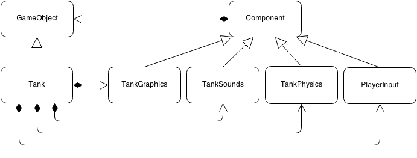
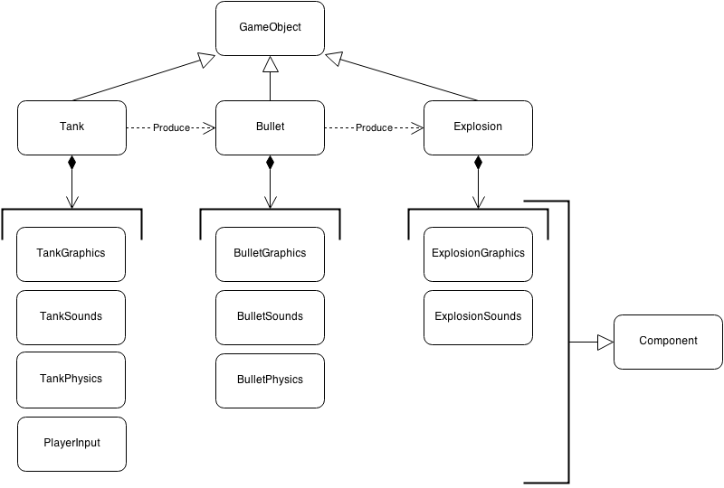
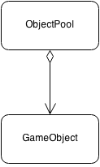

# Refactoring The Prototype

At this point you may be thinking where to go next. We want to implement enemies, collision
detection and AI, but design of current prototype is already limiting. Code is becoming tightly
coupled, there is no clean separation between different domains.

If we were to continue building on top of our prototype, things would get ugly quickly. Thus we
will untangle the spaghetti and rewrite some parts from scratch to achieve elegance.

## Game Programming Patterns

I would like to tip my hat to Robert Nystrom, who wrote this amazing book called [Game Programming
Patterns](http://gameprogrammingpatterns.com/). The book is available online for free, it is a
relatively quick read - I've devoured it with pleasure in roughly 4 hours. If you are guessing that
this chapter is inspired by that book, you are absolutely right.

[Component](http://gameprogrammingpatterns.com/component.html) pattern is especially noteworthy.
We will be using it to do major housekeeping, and it is great time to do so, because we haven't
implemented much of the game yet.

## What Is Wrong With Current Design

Until this point we have been building the code in monolithic fashion. `Tank` class holds the code
that:

1. Loads all ground unit sprites. If some other class handled it, we could reuse the code to load
other units.
2. Handles sound effects.
3. Uses [`Gosu::Song`](http://www.libgosu.org/rdoc/Gosu/Song.html) for moving sounds. That limits
only one tank movement sound per whole game. Basically, we abused Gosu here.
4. Handles keyboard and mouse. If we were to create AI that controls the tank, we would not be able to reuse `Tank` class because of this.
5. Draws graphics on screen.
6. Calculates physical properties, like speed, acceleration.
7. Detects movement collisions.

`Bullet` is not perfect either:

1. It renders it's graphics.
2. It handles it's movement trajectories and other physics.
3. It treats `Explosion` as part of it's own lifecycle.
4. Draws graphics on screen.
5. Handles sound effects.

Even the relatively small `Explosion` class is too monolithic:

1. It loads it's graphics.
2. It handles rendering, animation and frame skipping
3. It loads and plays it's sound effects.

## Decoupling Using Component Pattern

Best design separates concerns in code so that everything has it's own place, and every class
handles only one thing. Let's try splitting up `Tank` class into components that handle specific
domains:

We will introduce `GameObject` class will contain shared functionality for all game objects
(`Tank`, `Bullet`, `Explosion`), each of them would have it's own set of components. Every
component will have it's parent object, so it will be able to interact with it, change it's
attributes, or possibly invoke other components if it comes to that.

All these objects will be held within
[`ObjectPool`](http://gameprogrammingpatterns.com/object-pool.html), which would not care to know
if object is a tank or a bullet. Purpose of `ObjectPool` is a little different
 in Ruby, since GC will take
care of memory fragmentation for us, but we still need a single place that knows about every object
in the game.

`PlayState` would then iterate through `@object_pool.objects` and invoke `update` and `draw` methods.

Now, let's begin by implementing base class for `GameObject`:

<<[05-refactor/entities/game_object.rb](code/05-refactor/entities/game_object.rb)

When `GameObject` is initialized, it registers itself with `ObjectPool` and prepares empty
`@components` array. Concrete `GameObject` classes should initialize `Components` so that array
would not be empty.

`update` and `draw` methods would cycle through `@components` and delegate those calls to each of
them in a sequence. It is important to `update` all components first, and only then `draw` them.
Keep in mind that `@components` array order has significance. First elements will always be updated
and drawn before last ones.

We will also provide `removable?` method that
would return `true` for objects that `mark_for_removal` was invoked on. This way we will be able to
weed out old bullets and explosions and feed them to GC.

Next up, base `Component` class:

<<[05-refactor/entities/components/component.rb](code/05-refactor/entities/components/component.rb)

It registers itself with `GameObject#components`, provides some protected methods to access parent
object and it's most often called properties - `x` and `y`.

### Refactoring Explosion

`Explosion` was probably the smallest class, so we will extract it's components first.

<<[05-refactor/entities/explosion.rb](code/05-refactor/entities/explosion.rb)

It is much cleaner than before. `ExplosionGraphics` will be a `Component` that handles animation,
and `ExplosionSounds` will play a sound.

<<[05-refactor/entities/components/explosion_graphics.rb](code/05-refactor/entities/components/explosion_graphics.rb)

Everything that is related to animating the explosion is now clearly separated.
`mark_for_removal` is called on the explosion after it's animation is done.

<<[05-refactor/entities/components/explosion_sounds.rb](code/05-refactor/entities/components/explosion_sounds.rb)

Since explosion sounds are triggered only once, when it starts to explode, `ExplosionSounds` is a
static class with `play` method.

### Refactoring Bullet

Now, let's go up a little and reimplement our `Bullet`:

<<[05-refactor/entities/bullet.rb](code/05-refactor/entities/bullet.rb)

All physics, graphics and sounds are extracted into individual components, and instead of managing
`Explosion`, it just registers a new `Explosion` with `ObjectPool` and marks
itself for removal in `explode` method.

<<[05-refactor/entities/components/bullet_physics.rb](code/05-refactor/entities/components/bullet_physics.rb)

`BulletPhysics` is where the most of `Bullet` ended up at. It does all the calculations and
triggers `Bullet#explode` when ready. When we will be implementing collision detection, the
implementation will go somewhere here.

<<[05-refactor/entities/components/bullet_graphics.rb](code/05-refactor/entities/components/bullet_graphics.rb)

After pulling away `Bullet` graphics code, it looks very small and elegant. We will probably never
have to edit anything here again.

<<[05-refactor/entities/components/bullet_sounds.rb](code/05-refactor/entities/components/bullet_sounds.rb)

Just like `ExplosionSounds`, `BulletSounds` are stateless and static. We could make it just like a
regular component, but consider it our little optimization.

### Refactoring Tank

Time to take a look at freshly decoupled `Tank`:

<<[05-refactor/entities/tank.rb](code/05-refactor/entities/tank.rb)

`Tank` class was reduced over 5 times. We could go further and extract `Gun` component, but for now
it's simple enough already. Now, the components.

<<[05-refactor/entities/components/tank_physics.rb](code/05-refactor/entities/components/tank_physics.rb)

While we had to rip player input away from it's movement, we got ourselves a benefit - tank now
both accelerates and decelerates. When directional buttons are no longer pressed, tank keeps moving
in last direction, but quickly decelerates and stops. Another addition that would have been more
difficult to implement on previous `Tank` is collision sound. When `Tank` abruptly stops by hitting
something (for now it's only water), collision sound is played. We will have to fix that, because
metal bang is not appropriate when you stop on the edge of a river, but we now did it for the sake
of science.

<<[05-refactor/entities/components/tank_graphics.rb](code/05-refactor/entities/components/tank_graphics.rb)

Again, graphics are neatly packed and separated from everything else. Eventually we should optimize
`draw` to take `viewport` into consideration, but it's good enough for now, especially when we have
only one tank in the game.

<<[05-refactor/entities/components/tank_sounds.rb](code/05-refactor/entities/components/tank_sounds.rb)

Unlike `Explosion` and `Bullet`, `Tank` sounds are stateful. We have to keep track of
`tank_driving.mp3`, which is no longer [`Gosu::Song`](http://www.libgosu.org/rdoc/Gosu/Song.html),
but [`Gosu::Sample`](http://www.libgosu.org/rdoc/Gosu/Sample.html), like it should have been.

When [`Gosu::Sample#play`](http://www.libgosu.org/rdoc/Gosu/Sample.html#play-instance_method) is
invoked, [`Gosu::SampleInstance`](http://www.libgosu.org/rdoc/Gosu/SampleInstance.html) is
returned, and we have full control over it. Now we are ready to play sounds for more than one tank
at once.

<<[05-refactor/entities/components/player_input.rb](code/05-refactor/entities/components/player_input.rb)

We finally come to a place where keyboard and mouse input is handled and converted to `Tank`
commands. We could have used [`Command`](http://gameprogrammingpatterns.com/command.html) pattern
to decouple everything even further.

### Refactoring PlayState

<<[05-refactor/game_states/play_state.rb](code/05-refactor/game_states/play_state.rb)

Implementation of `PlayState` is now also a little simpler. It doesn't update `@tank` or `@bullets`
individually anymore. Instead, it uses `ObjectPool` and does all object operations in bulk.

### Other Improvements

<<[05-refactor/main.rb](code/05-refactor/main.rb)

Finally, we made some improvements to `main.rb` - it now recursively requires all `*.rb` files
within same directory, so we don't have to worry about it in other classes.

<<[05-refactor/utils.rb](code/05-refactor/utils.rb)

Another notable change is renaming `Game` module into `Utils`. The name finally makes more sense, I
have no idea why I put utility methods into `Game` module in the first place. Also, `Utils`
received `button_down?` method, that solves the issue of changing tank direction when button is
immediately released. It made very difficult to stop at diagonal angle, because when you depressed
two buttons, 16 ms was enough for Gosu to think "he released W, and S is still pressed, so let's
change direction to S". `Utils#button_down?` gives a soft 150 ms window to synchronize button
release. Now controls feel more natural.
