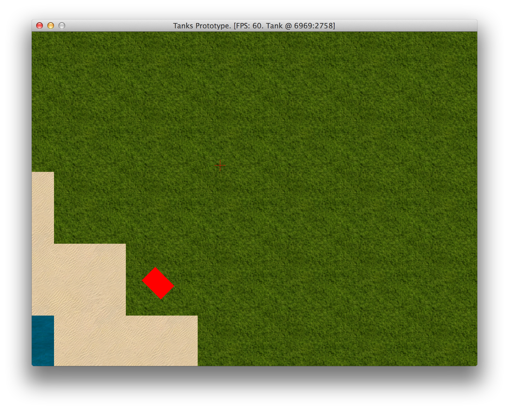

# Simulating Physics

To make the game more realistic, we will spice things up with some physics. This is the feature set
we are going to implement:

1. Collision detection. Tank will bump into other objects - stationary tanks. Bullets will not go
through them either.
2. Terrain effects. Tank will go fast on grass, slower on sand.

## Adding Enemy Objects

It's boring to play alone, so we will make a quick change and spawn some stationary tanks that will
be deployed randomly around the map. They will be stationary in the beginning, but we will still
need a dummy AI class to replace `PlayerInput`:

<<[06-physics/entities/components/ai_input.rb](code/06-physics/entities/components/ai_input.rb)

A quick and dirty way to spawn some tanks would be when initializing `PlayState`:

{line-numbers="off"}
~~~~~~~~
class PlayState < GameState
  # ...
  def initialize
    @map = Map.new
    @camera = Camera.new
    @object_pool = ObjectPool.new(@map)
    @tank = Tank.new(@object_pool, PlayerInput.new(@camera))
    @camera.target = @tank
    # ...
    50.times do
      Tank.new(@object_pool, AiInput.new)
    end
  end
  # ...
end
~~~~~~~~

And unless we want all stationary tanks face same direction, we will randomize it:

{line-numbers="off"}
~~~~~~~~
class Tank < GameObject
  # ...
  def initialize(object_pool, input)
    # ...
    @direction = rand(0..7) * 45
    @gun_angle = rand(0..360)
  end
  # ...
end
~~~~~~~~

Fire up the game, and wander around frozen tanks. You can pass through them as if they were ghosts,
but we will fix that in a moment.

## Adding Bounding Boxes And Detecting Collisions

We want our collision detection to be pixel perfect, that means we need to have a bounding box and
check colisions against it. Get ready for some math!

First, we need to find a correct way to construct a bounding box. Tank has it's body image, so
let's see how it's boundaries look like. We will add some code to `TankGraphics` component to see
it:

{line-numbers="off"}
~~~~~~~~
class TankGraphics < Component
  def draw(viewport)
    # ...
    draw_bounding_box
  end

  def draw_bounding_box
    $window.rotate(object.direction, x, y) do
      w = @body.width
      h = @body.height
      $window.draw_quad(
        x - w / 2, y - h / 2, Gosu::Color::RED,
        x + w / 2, y - h / 2, Gosu::Color::RED,
        x + w / 2, y + h / 2, Gosu::Color::RED,
        x - w / 2, y + h / 2, Gosu::Color::RED,
        100)
    end
  end
  # ...
end
~~~~~~~~

Result is pretty good, we have tank shaped box, so we will be using body image dimensions to determine
our bounding box corners:

There is one problem here though.
[`Gosu::Window#rotate`](http://www.libgosu.org/rdoc/Gosu/Window.html#rotate-instance_method) does
the rotation math for us, and we need to perform these calculations on our own. We have four points
that we want to rotate around a center point. It's not very difficult to find how to do this. Here
is a Ruby method for you:

{line-numbers="off"}
~~~~~~~~
module Utils
  # ...
  def self.rotate(angle, around_x, around_y, *points)
    result = []
    points.each_slice(2) do |x, y|
      r_x = Math.cos(angle) * (x - around_x) -
        Math.sin(angle) * (y - around_y) + around_x
      r_y = Math.sin(angle) * (x - around_x) +
        Math.cos(angle) * (y - around_y) + around_y
      result << r_x
      result << r_y
    end
    result
  end
  # ...
end
~~~~~~~~

We can now calculate edges of our bounding box, but we need one more function which tells if point
is inside a polygon. This problem has been solved million times before, so just poke the internet
for it and drink from the information firehose until you understand how to do this.

If you wasn't familiar with the term yet, by now you should discover what
[vertex](http://en.wikipedia.org/wiki/Vertex_(geometry)) is. In geometry, a vertex (plural
vertices) is a special kind of point that describes the corners or intersections of geometric
shapes.

Here's what I ended up writing:

{line-numbers="off"}
~~~~~~~~
module Utils
  # ...
  # http://www.ecse.rpi.edu/Homepages/wrf/Research/Short_Notes/pnpoly.html
  def self.point_in_poly(testx, testy, *poly)
    nvert = poly.size / 2 # Number of vertices in poly
    vertx = []
    verty = []
    poly.each_slice(2) do |x, y|
      vertx << x
      verty << y
    end
    inside = false
    j = nvert - 1
    (0..nvert - 1).each do |i|
      if (((verty[i] > testy) != (verty[j] > testy)) &&
         (testx < (vertx[j] - vertx[i]) * (testy - verty[i]) /
         (verty[j] - verty[i]) + vertx[i]))
        inside = !inside
      end
      j = i
    end
    inside
  end
  # ...
~~~~~~~~

It is [Jordan curve theorem](http://en.wikipedia.org/wiki/Jordan_curve_theorem) reimplemented in
Ruby. Looks ugly, but it actually works, and is pretty fast too.

Also, this works on more sophisticated polygons, and our tank is shaped more like an H rather than
a rectangle, so we could define a pixel perfect polygon. Some pen and paper will help.

{line-numbers="off"}
~~~~~~~~
class TankPhysics < Component
  #...

  # Tank box looks like H. Vertices:
  # 1   2   5   6
  #     3   4
  #
  #    10   9
  # 12 11   8   7
  def box
    w = box_width / 2 - 1
    h = box_height / 2 - 1
    tw = 8 # track width
    fd = 8 # front depth
    rd = 6 # rear depth
    Utils.rotate(object.direction, x, y,
                 x + w,      y + h,      #1
                 x + w - tw, y + h,      #2
                 x + w - tw, y + h - fd, #3

                 x - w + tw, y + h - fd, #4
                 x - w + tw, y + h,      #5
                 x - w,      y + h,      #6

                 x - w,      y - h,      #7
                 x - w + tw, y - h,      #8
                 x - w + tw, y - h + rd, #9

                 x + w - tw, y - h + rd, #10
                 x + w - tw, y - h,      #11
                 x + w,      y - h,      #12
                )
  end
  # ...
end
~~~~~~~~

To visually see it, we will improve our `draw_bounding_box` method:

{line-numbers="off"}
~~~~~~~~
class TankGraphics < Component
  # ...
  DEBUG_COLORS = [
    Gosu::Color::RED,
    Gosu::Color::BLUE,
    Gosu::Color::YELLOW,
    Gosu::Color::WHITE
  ]
  # ...
  def draw_bounding_box
    i = 0
    object.box.each_slice(2) do |x, y|
      color = DEBUG_COLORS[i]
      $window.draw_triangle(
        x - 3, y - 3, color,
        x,     y,     color,
        x + 3, y - 3, color,
        100)
      i = (i + 1) % 4
    end
  end
  # ...
~~~~~~~~

Now we can visually test bounding box edges and see that they actually are where they belong.

Time to pimp our `TankPhysics` to detect those collisions. While our algorithm is pretty fast, it
doesn't make sense to check collisions for objects that are pretty far apart. This is why we need
our `ObjectPool` to know how to query objects in close proximity.

{line-numbers="off"}
~~~~~~~~
class ObjectPool
  # ...
  def nearby(object, max_distance)
    @objects.select do |obj|
      distance = Utils.distance_between(
        obj.x, obj.y, object.x, object.y)
      obj != object && distance < max_distance
    end
  end
end
~~~~~~~~

Back to `TankPhysics`:

{line-numbers="off"}
~~~~~~~~
class TankPhysics < Component
  # ...
  def can_move_to?(x, y)
    old_x, old_y = object.x, object.y
    object.x = x
    object.y = y
    return false unless @map.can_move_to?(x, y)
    @object_pool.nearby(object, 100).each do |obj|
      if collides_with_poly?(obj.box)
        # Allow to get unstuck
        old_distance = Utils.distance_between(
          obj.x, obj.y, old_x, old_y)
        new_distance = Utils.distance_between(
          obj.x, obj.y, x, y)
        return false if new_distance < old_distance
      end
    end
    true
  ensure
    object.x = old_x
    object.y = old_y
  end
  # ...
  private

  def collides_with_poly?(poly)
    if poly
      poly.each_slice(2) do |x, y|
        return true if Utils.point_in_poly(x, y, *box)
      end
      box.each_slice(2) do |x, y|
        return true if Utils.point_in_poly(x, y, *poly)
      end
    end
    false
  end
  # ...
end
~~~~~~~~

It's probably not the most elegant solution you could come up with, but `can_move_to?` temporarily
changes `Tank` location to make a collision test, and then reverts old coordinates just before
returning the result. Now our tanks stop with banging sound when they hit each other.

## Catching Bullets

Right now bullets fly right through our tanks, and we want them to collide. It's a pretty simple
change, which mostly affects `BulletPhysics` class:

{line-numbers="off"}
~~~~~~~~
# 06-physics/entities/components/bullet_physics.rb
class BulletPhysics < Component
  # ...
  def update
    # ...
    check_hit
    object.explode if arrived?
  end
  # ...
  private

  def check_hit
    @object_pool.nearby(object, 50).each do |obj|
      next if obj == object.source # Don't hit source tank
      if Utils.point_in_poly(x, y, *obj.box)
        object.target_x = x
        object.target_y = y
        return
      end
    end
  end
  # ...
end
~~~~~~~~

Now bullets finally hit, but don't do any damage yet. We will come back to that soon.

## Implementing Turn Speed Penalties

Tanks cannot make turns and go into reverse at full speed while keeping it's inertia, right? It is
easy to implement. Since it's related to physics, we will delegate changing `Tank`'s `@direction`
to our `TankPhysics` class:

{line-numbers="off"}
~~~~~~~~
# 06-physics/entities/components/player_input.rb
class PlayerInput < Component
  # ...
  def update
    # ...
    motion_buttons = [Gosu::KbW, Gosu::KbS, Gosu::KbA, Gosu::KbD]

    if any_button_down?(*motion_buttons)
      object.throttle_down = true
      object.physics.change_direction(
        change_angle(object.direction, *motion_buttons))
    else
      object.throttle_down = false
    end
    # ...
  end
  # ...
end

# 06-physics/entities/components/tank_physics.rb
class TankPhysics < Component
  # ...
  def change_direction(new_direction)
    change = (new_direction - object.direction + 360) % 360
    change = 360 - change if change > 180
    if change > 90
      @speed = 0
    elsif change > 45
      @speed *= 0.33
    elsif change > 0
      @speed *= 0.66
    end
    object.direction = new_direction
  end
  # ...
end
~~~~~~~~

## Implementing Terrain Speed Penalties

Now, let's see how can we make terrain influence our movement. It sounds reasonable for
`TankPhysics` to consult with `Map` about speed penalty of current tile:

{line-numbers="off"}
~~~~~~~~
# 06-physics/entities/map.rb
class Map
  # ...
  def movement_penalty(x, y)
    tile = tile_at(x, y)
    case tile
    when @sand
      0.33
    else
      0
    end
  end
  # ...
end

# 06-physics/entities/components/tank_physics.rb
class TankPhysics < Component
  # ...
  def update
    # ...
      speed = apply_movement_penalty(@speed)
      shift = Utils.adjust_speed(speed)
    # ...
  end
  # ...

  private

  def apply_movement_penalty(speed)
    speed * (1.0 - @map.movement_penalty(x, y))
  end
  # ...
end
~~~~~~~~

This makes all tanks move 33% slower on sand.
