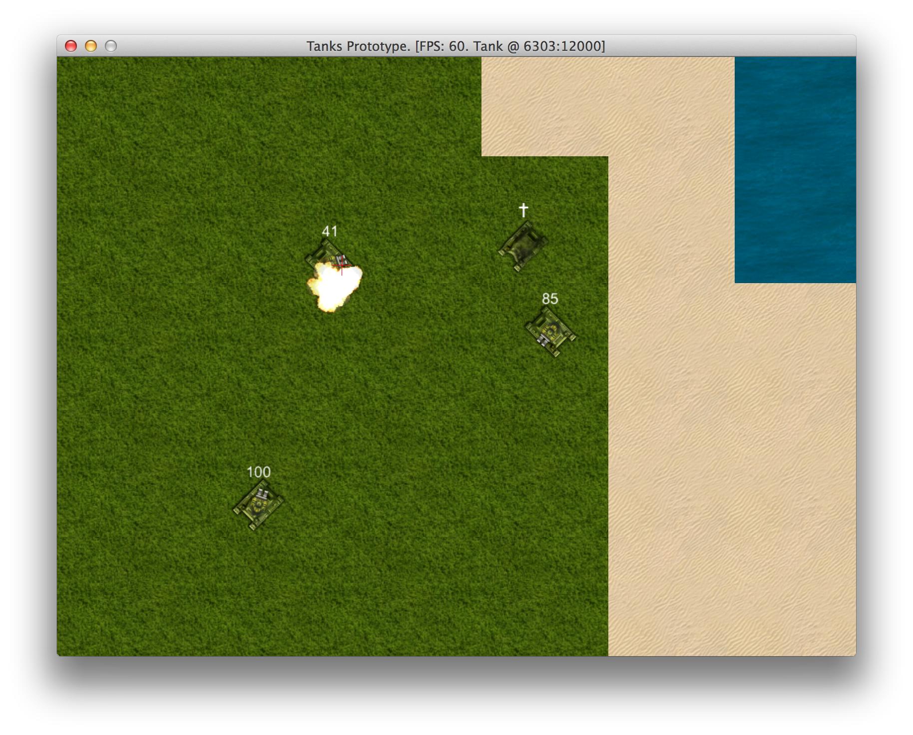

# Implementing Health And Damage

I know you have been waiting for this. We will be implementing health system and most importantly,
damage. Soo we will be ready to blow shit up.

To implement this, we need to:

1. Add `TankHealth` component. Start with 100 health.
2. Render tank health next to tank itself.
3. Inflict damage to tank when it is in explosion zone
4. Render different sprite for dead tank.
5. Cut off player input when tank is dead.

## Adding Health Component

If we didn't have `Component` system in place, it would be way more difficult. Now we just kick in
a new class:

<<[07-damage/entities/components/tank_health.rb](code/07-damage/entities/components/tank_health.rb)

It hooks itself into the game right away, after we initialize it in `Tank` class:

{line-numbers="off"}
~~~~~~~~
class Tank < GameObject
  attr_accessor :health
  # ...
  def initialize(object_pool, input)
    # ...
    @health = TankHealth.new(self, object_pool)
    # ..
  end
  # ..
end
~~~~~~~~

## Inflicting Damage With Bullets

There are two ways to inflict damage - directly and indirectly. When bullet hits enemy tank
(collides with tank bounding box), we should inflict direct damage. It can be done in
`BulletPhysics#check_hit` method that we already had:

{line-numbers="off"}
~~~~~~~~
class BulletPhysics < Component
  # ...
  def check_hit
    @object_pool.nearby(object, 50).each do |obj|
      next if obj == object.source # Don't hit source tank
      if Utils.point_in_poly(x, y, *obj.box)
        # Direct hit - extra damage
        obj.health.inflict_damage(20)
        object.target_x = x
        object.target_y = y
        return
      end
    end
  end
  # ...
end
~~~~~~~~

Finally, `Explosion` itself should inflict additional damage to anything that are nearby. The
effect will be diminishing and it will be determined by object distance.

{line-numbers="off"}
~~~~~~~~
class Explosion < GameObject
  # ...
  def initialize(object_pool, x, y)
    # ...
    inflict_damage
  end

  private

  def inflict_damage
    object_pool.nearby(self, 100).each do |obj|
      if obj.class == Tank
        obj.health.inflict_damage(
          Math.sqrt(3 * 100 - Utils.distance_between(
              obj.x, obj.y, x, y)))
      end
    end
  end
end
~~~~~~~~

This is it, we are ready to deal damage. But we want to see if we actually killed somebody, so
`TankGraphics` should be aware of health and should draw different set of sprites when tank is
dead. Here is what we need to change in our current TankGraphics to achieve the result:

{line-numbers="off"}
~~~~~~~~
class TankGraphics < Component
  # ...
  def initialize(game_object)
    super(game_object)
    @body_normal = units.frame('tank1_body.png')
    @shadow_normal = units.frame('tank1_body_shadow.png')
    @gun_normal = units.frame('tank1_dualgun.png')
    @body_dead = units.frame('tank1_body_destroyed.png')
    @shadow_dead = units.frame('tank1_body_destroyed_shadow.png')
    @gun_dead = nil
  end

  def update
    if object.health.dead?
      @body = @body_dead
      @gun = @gun_dead
      @shadow = @shadow_dead
    else
      @body = @body_normal
      @gun = @gun_normal
      @shadow = @shadow_normal
    end
  end

  def draw(viewport)
    @shadow.draw_rot(x - 1, y - 1, 0, object.direction)
    @body.draw_rot(x, y, 1, object.direction)
    @gun.draw_rot(x, y, 2, object.gun_angle) if @gun
  end
  # ...
end
~~~~~~~~

Now we can blow them up and enjoy the view:

But what if we blow ourselves up by shooting nearby? We would still be able to move around. To fix
this, we will simply cut out player input when we are dead:

{line-numbers="off"}
~~~~~~~~
class PlayerInput < Component
  # ...
  def update
    return if object.health.dead?
    # ...
  end
  # ...
end
~~~~~~~~

And to prevent tank from throttling forever if the pedal was down before it got killed:

{line-numbers="off"}
~~~~~~~~
class TankPhysics < Component
  # ...
  def update
    if object.throttle_down && !object.health.dead?
      accelerate
    else
      decelerate
    end
    # ...
  end
  # ...
end
~~~~~~~~

That's it. All we need right now is some resistance from those brain dead enemies. We will spark
some life into them in next chapter.
