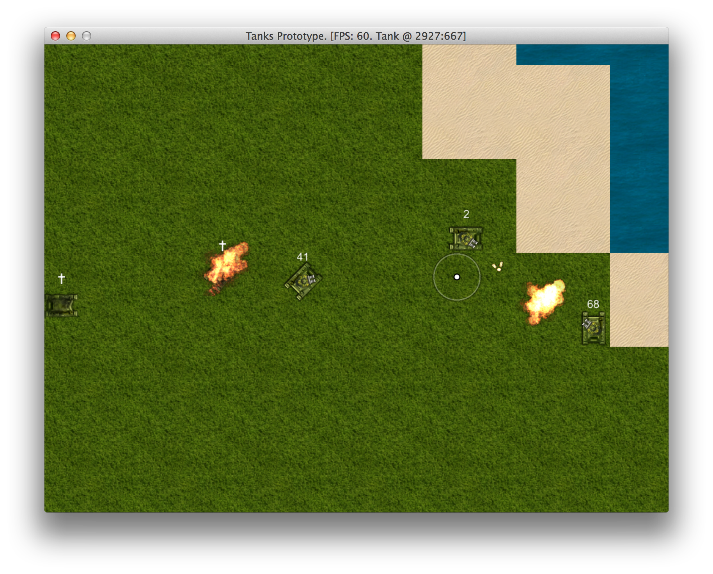

# Creating Artificial Intelligence

Artificial Intelligence is a subject so vast that we will barely scratch the surface.
[AI in Video Games](http://en.wikipedia.org/wiki/Artificial_intelligence_(video_games))
is usually heavily simplified and therefore easier to implement.

There is this wonderful series of articles called
[Designing Artificial Intelligence for Games](https://software.intel.com/en-us/articles/designing-artificial-intelligence-for-games-part-1/)
that I highly recommend reading to get a feeling how game AI should be done. We will be
continuing our work on top of what we already have, example code for this chapter will be in `08-ai`.

## Designing AI Using Finite State Machine

Non player tanks in our game will be lone rangers, hunting everything that moves while trying to
survive. We will use [Finite State Machine](http://en.wikipedia.org/wiki/Finite-state_machine) to implement tank behavior.

First, we need to think "what would a tank do?" How about this scenario:

1. Tank wanders around, minding it's own business.
2. Tank encounters another tank. It then starts doing evasive moves and tries hitting the enemy.
3. Enemy took some damage and started driving away. Tank starts chasing the enemy trying to finish
it.
4. Another tank appears and fires a couple of accurate shots, dealing serious damage. Our tank
starts running away, because if it kept receiving damage at such rate, it would die very soon.
5. Tank keeps fleeing and looking for safety until it gets cornered or the opponent looks damaged
too. Then tank goes into it's final battle.

We can now draw a Finite State Machine using this scenario:

If you are on a path to become a game developer, FSM should not stand for [Flying Spaghetti
Monster](http://en.wikipedia.org/wiki/Flying_Spaghetti_Monster) for you anymore.

## Implementing AI Vision

To make opponents realistic, we have to give them senses. Let's create a class for that:

<<[08-ai/entities/components/ai/vision.rb](code/08-ai/entities/components/ai/vision.rb)

It uses `ObjectPool` to put nearby objects in sight, and gets a short term focus on one closest
tank. Closest tank is cached for 500 milliseconds for two reasons:

1. Performance. Uncached version would do `Array#select` and `Array#sort` 60 times per second, now
it will do 2 times.
2. Focus. When you choose a target, you should keep it a little longer. This should also avoid
"jitters", when tank would shake between two nearby targets that are within same distance.

## Controlling Tank Gun

After we made `AiVision`, we can now use it to automatically aim and shoot at closest tank. It
should work like this:

1. Every instance of the gun has it's own unique combination of speed, accuracy and aggressiveness.
2. Gun will automatically target closest tank in sight.
3. If no other tank is in sight, gun will target in same direction as tank's body.
4. If other tank is aimed at and within shooting distance, gun will make a decision once in a while
whether it should shoot or not, based on aggressiveness level. Aggressive tanks will be trigger
happy all the time, while less aggressive ones will make small random pauses between shots.
5. Gun will have a "desired" angle that it will be automatically adjusting to, according to it's speed.

Here is the implementation:

<<[08-ai/entities/components/ai/gun.rb](code/08-ai/entities/components/ai/gun.rb)

## Implementing AI Input

At this point our tanks can already defend themselves, even through motion is not yet implemented.
Let's wire everything we have in `AiInput` class that we had prepared earlier. We
will need a blank `TankMotionFSM` class with 3 argument initializer and empty `update`,
`on_collision(with)` and `on_damage(amount)` methods for it to work:

<<[08-ai/entities/components/ai_input.rb](code/08-ai/entities/components/ai_input.rb)

It adjust gun angle all the time, but does updates at `UPDATE_RATE` to save CPU power. AI is
usually one of the most CPU intensive things in games, so it's a common practice to execute it less
often. Refreshing enemy brains 5 per second is enough to make them deadly.

Make sure you spawn some AI controlled tanks in `PlayState` and try killing them now. I bet they
will eventually get you even while standing still. You can also make tanks spawn below mouse cursor
when you press `T` key:

{line-numbers="off"}
~~~~~~~~
class PlayState < GameState
  # ...
  def initialize
    # ...
    10.times do |i|
      Tank.new(@object_pool, AiInput.new(@object_pool))
    end
  end
  # ...
  def button_down(id)
    # ...
    if id == Gosu::KbT
      t = Tank.new(@object_pool,
                   AiInput.new(@object_pool))
      t.x, t.y = @camera.mouse_coords
    end
    # ...
  end
  # ...
end
~~~~~~~~

## Implementing Tank Motion States

This is the place where we will need Finite State Machine to get things right. We will design it
like this:

1. `TankMotionFSM` will decide which motion state tank should be in, considering various
parameters, e.g. existence of target or lack thereof, health, etc.
2. There will be `TankMotionState` base class that will offer common methods like `drive`, `wait`
and `on_collision`.
3. Concrete motion classes will implement `update`, `change_direction` and other methods, that will
fiddle with `Tank#throttle_down` and `Tank#direction` to make it move and turn.

We will begin with `TankMotionState`:

<<[08-ai/entities/components/ai/tank_motion_state.rb](code/08-ai/entities/components/ai/tank_motion_state.rb)

Nothing extraordinary here, and we need a concrete implementation to get a feeling how it would
work, therefore let's examine `TankRoamingState`. It will be the default state which tank would be
in if there were no enemies around.

### Tank Roaming State

<<[08-ai/entities/components/ai/tank_roaming_state.rb](code/08-ai/entities/components/ai/tank_roaming_state.rb)

The logic here:

1. Tank will randomly change direction every `turn_time` interval, which is between 2 and 5
seconds.
2. Tank will choose to drive (80% chance) or to stand still (20% chance).
3. If tank chose to drive, it will keep driving for `drive_time`, which is between 1 and 5 seconds.
4. Same goes with waiting, but `wait_time` (0.5 - 2 seconds) will be used for duration.
5. Direction changes and driving / waiting are independent.

This will make an impression that our tank is driving around looking for enemies.

### Tank Fighting State

When tank finally sees an opponent, it will start fighting. Fighting motion should be more
energetic than roaming, we will need a sharper set of choices in `change_direction` among other
things.

<<[08-ai/entities/components/ai/tank_fighting_state.rb](code/08-ai/entities/components/ai/tank_fighting_state.rb)

We will have much less waiting and much more driving and turning.

### Tank Chasing State

If opponent is fleeing, we will want to set our direction towards the opponent and hit pedal to the
metal. No waiting here. `AiGun#desired_gun_angle` will point directly to our enemy.

<<[08-ai/entities/components/ai/tank_chasing_state.rb](code/08-ai/entities/components/ai/tank_chasing_state.rb)

### Tank Fleeing State

Now, if our health is low, we will do the opposite of chasing. Gun will be pointing and shooting at the
opponent, but we want body to move away, so we won't get ourselves killed. It is very similar to
`TankChasingState` where `change_direction` adds extra 180 degrees to the equation, but there is
one more thing. Tank can only flee for a while. Then it gets itself together and goes into final
battle. That's why we provide `can_flee?` method that `TankMotionFSM` will consult with before
entering fleeing state.

We have implemented all the states, that means we are moments away from actually playable prototype
with tank bots running around and fighting with you and each other.

## Wiring Tank Motion States Into Finite State Machine

Implementing `TankMotionFSM` after we have all motion states ready is surprisingly easy:

<<[08-ai/entities/components/ai/tank_motion_fsm.rb](code/08-ai/entities/components/ai/tank_motion_fsm.rb)

All the logic is in `choose_state` method, which is pretty ugly and procedural, but it does the
job. The code should be easy to understand, so instead of describing it, here is a picture worth
thousand words:

You may notice a new crosshair, which replaced the old one that was never visible:

{line-numbers="off"}
~~~~~~~~
class Camera
  # ...
  def draw_crosshair
    factor = 0.5
    x = $window.mouse_x
    y = $window.mouse_y
    c = crosshair
    c.draw(x - c.width * factor / 2,
           y - c.height * factor / 2,
           1000, factor, factor)
  end
  # ...
  private

  def crosshair
    @crosshair ||= Gosu::Image.new(
      $window, Utils.media_path('c_dot.png'), false)
  end
end
~~~~~~~~

However this new crosshair didn't help me win, I got my ass kicked badly. Increasing game window
size helped, but we obviously need to fine tune many things in this AI, to make it smart and
challenging rather than dumb and deadly accurate.

