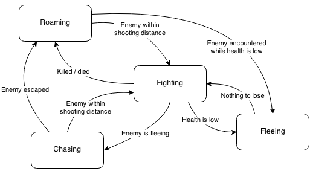

# Creating Artificial Intelligence

Artificial Intelligence is a subject so vast that we will barely scratch the surface.
[AI in Video Games](http://en.wikipedia.org/wiki/Artificial_intelligence_(video_games))
is usually heavily simplified and therefore easier to implement.

There is this wonderful series of articles called
[Designing Artificial Intelligence for Games](https://software.intel.com/en-us/articles/designing-artificial-intelligence-for-games-part-1/)
that I highly recommend reading to get a feeling how game AI should be done. We will be
continuing our work on top of what we already have, example code for this chapter will be in `06-ai`.

## Designing A.I. Using Finite State Machine

Non player tanks in our game will be lone rangers, hunting everything that moves while trying to
survive. We will use [Finite State Machine](http://en.wikipedia.org/wiki/Finite-state_machine) to implement tank behavior.

First, we need to think "what would a tank do?" How about this scenario:

1. Tank wanders around, minding it's own business.
2. Tank encounters another tank. It then starts doing evasive moves and tries hitting the enemy.
3. Enemy took some damage and started driving away. Tank starts chasing the enemy trying to finish
it.
4. Another tank appears and fires a couple of accurate shots, dealing serious damage. Our tank
starts running away, because if it kept receiving damage at such rate, it would die very soon.
5. Tank keeps fleeing and looking for safety until it gets cornered or the opponent looks damaged
too. Then tank goes into it's final battle.

We can now draw a Finite State Machine using this scenario:

If you are on a path to become a game developer, FSM should not stand for [Flying Spaghetti
Monster](http://en.wikipedia.org/wiki/Flying_Spaghetti_Monster) for you anymore.

### Implementing AI Vision

