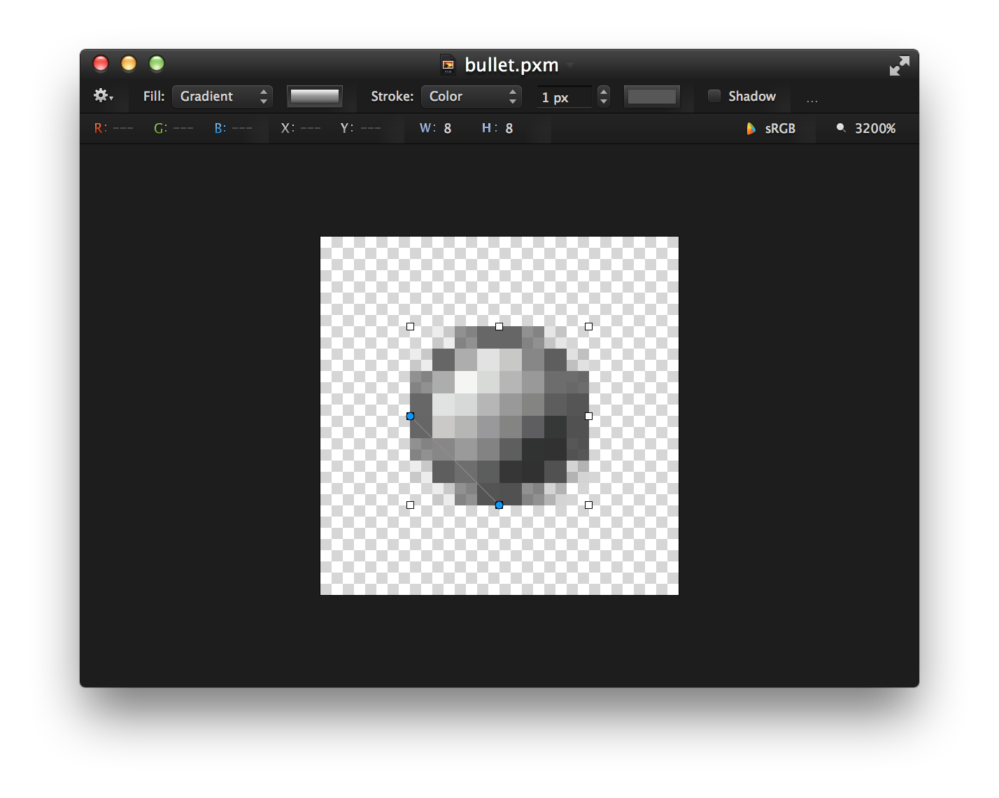
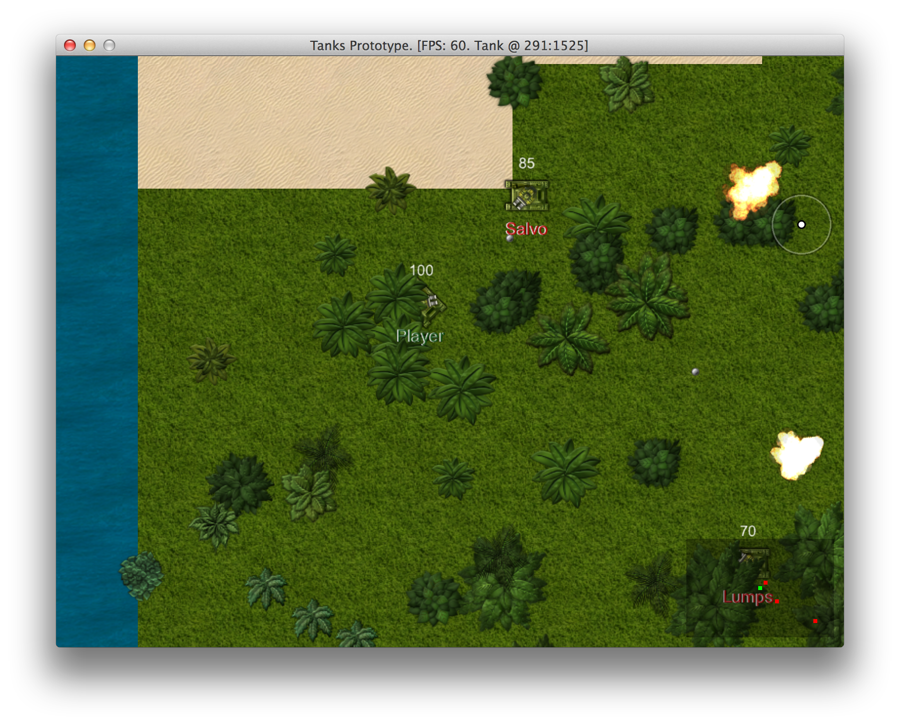
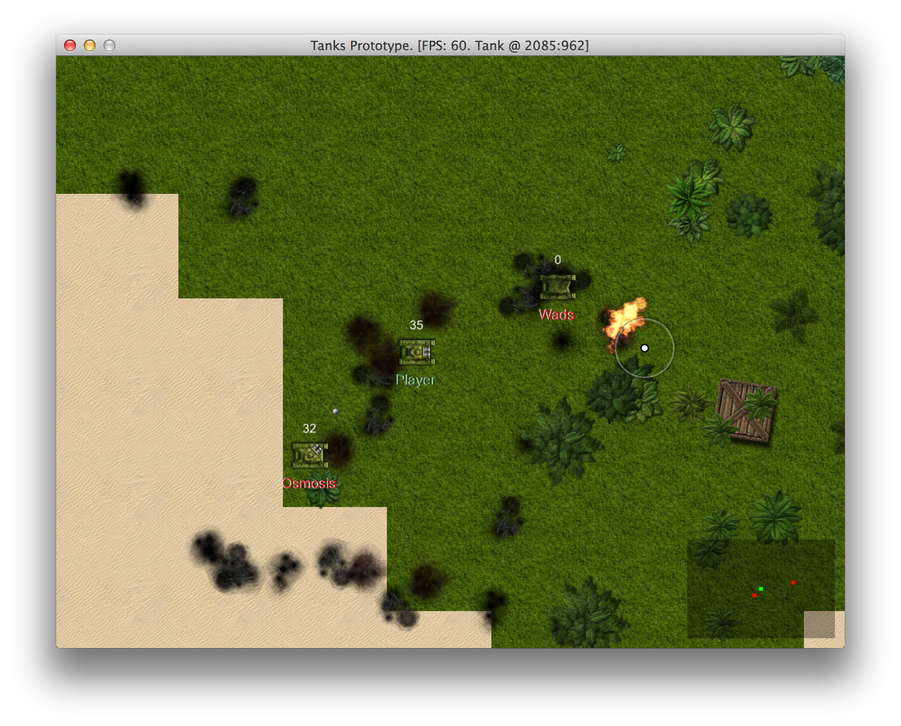

# Making The Prototype Playable

Right now we have a somewhat playable, but boring prototype without any scores or winning
conditions. You can just run around and shoot other tanks. Nobody would play a game like this,
hence we need to to add the missing parts. There is a crazy amount of them. It is time to give it a
thorough play through and write down all the ideas and pain points about the prototype.

Here is my list:

1. Enemy tanks do not respawn.
2. Enemy tanks shoot at my current location, not at where I will be when bullet
hits me.
3. Enemy tanks don't avoid collisions.
4. Random maps are boring and lack detail, could use more tiles or random environment objects.
5. Bullets are hard to see on green surface.
6. Hard to tell where enemies are coming from, radar would help.
7. Sounds play at full volume even when something happens across the whole map.
8. My tank should respawn after it's dead.
9. Motion and firing mechanics seem clumsy.
10. Map boundaries are visible when you come to the edge.
11. Enemy tank movement patterns need polishing and improvement.
12. Both my tank and enemies don't have any identity. Sometimes hard to distinguish who is who.
13. No idea who has most kills. HUD with score and some state that displays score details would
help.
14. Would be great to have random powerups like health, extra damage.
15. Explosions don't leave a trace.
16. Tanks could leave trails.
17. Dead tanks keep piling up and cluttering the map.
18. Camera should be scouting ahead of you when you move, not dragging behind.
19. Bullets seem to accelerate.

This will keep us busy for a while, but in the end we will probably have something that will
hopefully be able to entertain people for more than 3 minutes.

Some items on this list are easy fixes. After playing around with Pixelmator for 15 minutes, I
ended up with a bullet that is visible on both light and dark backgrounds:

Motion and firing mechanics will either have to be tuned setting by setting, or rewritten from
scratch. Implementing score system, powerups and improving enemy AI deserve to have chapters of
their own. The rest can be taken care of right away.

## Drawing Water Beyond Map Boundaries

We don't want to see darkness when we come to the edge of game world. Luckily, it is a trivial fix.
In `Map#draw` we check if tile exists in map before drawing it. When tile does not exist, we can
draw water instead. And we can always fallback to water tile in `Map#tile_at`:

{line-numbers="off"}
~~~~~~~~
class Map
  # ...
  def draw(viewport)
    viewport.map! { |p| p / TILE_SIZE }
    x0, x1, y0, y1 = viewport.map(&:to_i)
    (x0..x1).each do |x|
      (y0..y1).each do |y|
        row = @map[x]
        map_x = x * TILE_SIZE
        map_y = y * TILE_SIZE
        if row
          tile = @map[x][y]
          if tile
            tile.draw(map_x, map_y, 0)
          else
            @water.draw(map_x, map_y, 0)
          end
        else
          @water.draw(map_x, map_y, 0)
        end
      end
    end
  end
  # ...
  private
  # ...
  def tile_at(x, y)
    t_x = ((x / TILE_SIZE) % TILE_SIZE).floor
    t_y = ((y / TILE_SIZE) % TILE_SIZE).floor
    row = @map[t_x]
    row ? row[t_y] : @water
  end
  # ...
end
~~~~~~~~

Now the edge looks much better:

## Generating Tree Clusters

To make the map more fun to play at, we will generate some trees. Let's start with `Tree` class:

<<[09-polishing/entities/tree.rb](code/09-polishing/entities/tree.rb)

Nothing fancy here, we want it to shake on collision, and it has graphics and health. `seed` will
used to generate clusters of similar trees. Let's take a look at `TreeGraphics`:

<<[09-polishing/entities/components/tree_graphics.rb](code/09-polishing/entities/components/tree_graphics.rb)

Shaking is probably the most interesting part here. When `shake` is called, graphics will start
drawing tree shifted in given direction by amount defined in `SHAKE_DISTANCE` array. `draw` will be
stepping through `SHAKE_DISTANCE` depending on `SHAKE_TIME`, and it will not be shaken again for
`SHAKE_COOLDOWN` period, to avoid infinite shaking while driving into it.

We also need some adjustments to `TankPhysics` and `Tank` to be able to hit trees. First, we want
to create an empty `on_collision(object)` method in `GameObject` class, so all game objects will
be able to collide.

Then, `TankPhysics` starts calling `Tank#on_collision` when collision is detected:

{line-numbers="off"}
~~~~~~~~
class Tank < GameObject
  # ...
  def on_collision(object)
    return unless object
    # Avoid recursion
    if object.class == Tank
      # Inform AI about hit
      object.input.on_collision(object)
    else
      # Call only on non-tanks to avoid recursion
      object.on_collision(self)
    end
    # Bullets should not slow Tanks down
    if object.class != Bullet
      @sounds.collide if @physics.speed > 1
    end
  end
  # ...
end
~~~~~~~~

The final ingredient to our `Tree` is `Health`, which is extracted from `TankHealth` to reduce
duplication. `TankHealth` now extends it:

<<[09-polishing/entities/components/health.rb](code/09-polishing/entities/components/health.rb)

Yes, you can make tree explode when it's destroyed. And it causes cool chain reactions blowing up
whole tree clusters. But let's not do that, because we will add something more appropriate for
explosions.

Our `Tree` is ready to fill the landscape. We will do it in `Map` class, which will now need
to know about `ObjectPool`, because trees will go there.

{line-numbers="off"}
~~~~~~~~
class Map
  # ...
  def initialize(object_pool)
    load_tiles
    @object_pool = object_pool
    object_pool.map = self
    @map = generate_map
    generate_trees
  end
  # ...
  def generate_trees
    noises = Perlin::Noise.new(2)
    contrast = Perlin::Curve.contrast(
      Perlin::Curve::CUBIC, 2)
    trees = 0
    target_trees = rand(300..500)
    while trees < target_trees do
      x = rand(0..MAP_WIDTH * TILE_SIZE)
      y = rand(0..MAP_HEIGHT * TILE_SIZE)
      n = noises[x * 0.001, y * 0.001]
      n = contrast.call(n)
      if tile_at(x, y) == @grass && n > 0.5
        Tree.new(@object_pool, x, y, n * 2 - 1)
        trees += 1
      end
    end
  end
  # ...
end
~~~~~~~~

Perlin noise is used in similar fashion as it was when we generated map tiles. We allow creating
trees only if noise level is above `0.5`, and use noise level as seed value - `n * 2 - 1` will be a
number between 0 and 1 when `n` is in `0.5..1` range. And we only allow creating trees on grass
tiles.

Now our map looks a little better:

## Generating Random Objects

Trees are great, but we want more detail. Let's spice things up with explosive boxes and barrels.
They will be using the same class with single sprite sheet, so while the sprite will be chosen
randomly, behavior will be the same. This new class will be called `Box`:

<<[09-polishing/entities/box.rb](code/09-polishing/entities/box.rb)

It will be generated with slight random angle, to preserve realistic shadows but give an impression
of chaotic placement. Tanks will also be able to push boxes a little on collision, but only when
going fast enough. `Health` component is the same one that `Tree` has, but initialized with less
health and explosive flag is `true`, so the box will blow up after one hit and deal extra damage to
the surroundings.

`BoxGraphics` is nothing fancy, it just loads random sprite upon initialization:

<<[09-polishing/entities/components/box_graphics.rb](code/09-polishing/entities/components/box_graphics.rb)

Time to generate boxes in our `Map`. It will be similar to trees, but we won't need Perlin noise,
since there will be way fewer boxes than trees, so we don't need to form patterns. All we need to
do is to check if we're not generating box on water.

{line-numbers="off"}
~~~~~~~~
class Map
  # ...
  def initialize(object_pool)
    # ...
    generate_boxes
  end
  # ...
  def generate_boxes
    boxes = 0
    target_boxes = rand(10..30)
    while boxes < target_boxes do
      x = rand(0..MAP_WIDTH * TILE_SIZE)
      y = rand(0..MAP_HEIGHT * TILE_SIZE)
      if tile_at(x, y) != @water
        Box.new(@object_pool, x, y)
        boxes += 1
      end
    end
  end
  # ...
end
~~~~~~~~

Now give it a go. Beautiful, isn't it?

## Implementing A Radar

With all the visual noise it is getting increasingly difficult to see enemy tanks. That's why we
will implement a `Radar` to help ourselves.

<<[09-polishing/entities/radar.rb](code/09-polishing/entities/radar.rb)

`Radar`, like `Camera`, also has a target. It uses `ObjectPool` to query nearby objects and filters
out instances of alive `Tank`. Then it draws a transparent black background and small dots for each
tank, green for target, red for the rest.

To avoid querying `ObjectPool` too often, `Radar` updates itself only once every second.

It is initialized, updated and drawn in `PlayState`, right after `Camera`:

{line-numbers="off"}
~~~~~~~~
class PlayState < GameState
  # ...
  def initialize
    # ...
    @camera.target = @tank
    @radar = Radar.new(@object_pool, @tank)
    # ...
  end
  # ...
  def update
    # ...
    @camera.update
    @radar.update
    # ...
  end
  # ...
  def draw
    # ...
    @camera.draw_crosshair
    @radar.draw
  end
  # ...
end
~~~~~~~~

Time to enjoy the results.

## Dynamic Sound Volume And Panning

We have improved the visuals, but sound is still terrible. Like some superhero, you can hear
everything that happens in the map, and it can drive you insane. We will fix that in a moment.

The idea is to make everything that happens further away from camera target sound less loud, until
the sound fades away completely. To make player's experience more immersive, we will also take
advantage of stereo speakers - sounds should appear to be coming from the right direction.

Unfortunately,
[`Gosu::Sample#play_pan`](http://www.libgosu.org/rdoc/Gosu/Sample.html#play_pan-instance_method)
does not work as one would expect it to. If you play the sample with just a little panning, it
completely cuts off the opposite channel, meaning that if you play a sample with pan level of `0.1`
(10% to the right), you would expect to hear something in left speaker as well. The actual behavior
is that sound plays through the right speaker pretty loudly, and if you increase pan level to, say,
`0.7`, you will hear the sound through right speaker again, but it will be way more silent.

To implement realistic stereo sounds that come through both speakers when panned, we need to play
two samples with opposite `pan` level. After some experimenting, I discovered that fiddling with
`pan` level makes things sound weird, while playing with volume produces softer, more subtle
effect. This is what I ended up having:

<<[09-polishing/misc/stereo_sample.rb](code/09-polishing/misc/stereo_sample.rb)

`StereoSample` manages stereo playback of sample instances, and to avoid memory leaks, it has
`cleanup` that scans all sample instances and removes samples that have finished playing. For this
removal to work, we need to place a call to `StereoSample.cleanup` inside `PlayState#update`
method.

To determine correct pan and volume, we will create some helper methods in `Utils` module:

{line-numbers="off"}
~~~~~~~~
module Utils
  HEARING_DISTANCE = 1000.0
  # ...
  def self.volume(object, camera)
    return 1 if object == camera.target
    distance = Utils.distance_between(
      camera.target.x, camera.target.y,
      object.x, object.y)
    distance = [(HEARING_DISTANCE - distance), 0].max
    distance / HEARING_DISTANCE
  end

  def self.pan(object, camera)
    return 0 if object == camera.target
    pan = object.x - camera.target.x
    sig = pan > 0 ? 1 : -1
    pan = (pan % HEARING_DISTANCE) / HEARING_DISTANCE
    if sig > 0
      pan
    else
      -1 + pan
    end
  end

  def self.volume_and_pan(object, camera)
    [volume(object, camera), pan(object, camera)]
  end
end
~~~~~~~~

Apparently, having access to `Camera` is necessary for calculating sound volume and pan, so we will
add `attr_accessor :camera` to `ObjectPool` class and assign it in `PlayState` constructor. You may
wonder why we didn't use `Camera#target` right away. The answer is that camera can change it's
target. E.g. when your tank dies, new instance will be generated when you respawn, so if all other
objects would still have the reference to your old tank, guess what you would hear?

Remastered `TankSounds` component is probably the most elaborate example of how `StereoSample` should be used:

<<[09-polishing/entities/components/tank_sounds.rb](code/09-polishing/entities/components/tank_sounds.rb)

And this is how static `ExplosionSounds` looks like:

<<[09-polishing/entities/components/explosion_sounds.rb](code/09-polishing/entities/components/explosion_sounds.rb)

After wiring everything so that sound components have access to `ObjectPool`, the rest is
straightforward.

## Giving Enemies Identity

Wouldn't it be great if you could tell yourself apart from the enemies. Moreover, enemies could
have names, so you would know which one is more aggressive or have, you know, personal issues with
someone.

To do that we need to ask the player to input a nickname, and choose some funny names for each
enemy AI. Here is a nice list we will grab: http://www.paulandstorm.com/wha/clown-names/

We first compile everything into a text filed called `names.txt`, that looks like this:

{line-numbers="off",title="media/names.txt"}
~~~~~~~~
Strippy
Boffo
Buffo
Drips
...
~~~~~~~~

Now we need a class to parse the list and give out random names from it. We also want to limit name
length to something that displays nicely.

<<[09-polishing/misc/names.rb](code/09-polishing/misc/names.rb)

Then we need to place those names somewhere. We could assign them to tanks, but think ahead - if
our player and AI enemies will respawn, we should give names to inputs, because `Tank` is
replaceable, driver is not. Well, it is, but let's not get too deep into it.

For now we just add name parameter to `PlayerInput` and `AiInput` initializers, save it in `@name`
instance variable, and then add `draw(viewport)` method to make it render below the tank:

{line-numbers="off"}
~~~~~~~~
# 09-polishing/entities/components/player_input.rb
class PlayerInput < Component
  # Dark green
  NAME_COLOR = Gosu::Color.argb(0xee084408)

  def initialize(name, camera)
    super(nil)
    @name = name
    @camera = camera
  end
  # ...
  def draw(viewport)
    @name_image ||= Gosu::Image.from_text(
      $window, @name, Gosu.default_font_name, 20)
    @name_image.draw(
      x - @name_image.width / 2 - 1,
      y + object.graphics.height / 2, 100,
      1, 1, Gosu::Color::WHITE)
    @name_image.draw(
      x - @name_image.width / 2,
      y + object.graphics.height / 2, 100,
      1, 1, NAME_COLOR)
  end
  # ...
end

# 09-polishing/entities/components/ai_input.rb
class AiInput < Component
  # Dark red
  NAME_COLOR = Gosu::Color.argb(0xeeb10000)

  def initialize(name, object_pool)
    super(nil)
    @object_pool = object_pool
    @name = name
    @last_update = Gosu.milliseconds
  end
  # ...
  def draw(viewport)
    @motion.draw(viewport)
    @gun.draw(viewport)
    @name_image ||= Gosu::Image.from_text(
      $window, @name, Gosu.default_font_name, 20)
    @name_image.draw(
      x - @name_image.width / 2 - 1,
      y + object.graphics.height / 2, 100,
      1, 1, Gosu::Color::WHITE)
    @name_image.draw(
      x - @name_image.width / 2,
      y + object.graphics.height / 2, 100,
      1, 1, NAME_COLOR)
  end
  # ...
end
~~~~~~~~

We can see that generic `Input` class can be easily extracted, but let's follow the
[Rule of three](http://en.wikipedia.org/wiki/Rule_of_three_(computer_programming)) and
not do premature refactoring.

Instead, run the game and enjoy dying from a bunch of mad clowns.

## Respawning Tanks And Removing Dead Ones

To implement respawning we could use `Map#find_spawn_point` every time we wanted to respawn, but it
may get slow, because it brute forces the map for random spots that are not water. We don't want
our game to start freezing when tanks are respawning, so we will change how tank spawning works.
Instead of looking for a new respawn point all the time, we will pre-generate several of them for
reuse.

{line-numbers="off"}
~~~~~~~~
class Map
  # ...
  def spawn_points(max)
    @spawn_points = (0..max).map do
      find_spawn_point
    end
    @spawn_points_pointer = 0
  end

  def spawn_point
    @spawn_points[(@spawn_points_pointer += 1) % @spawn_points.size]
  end
  # ...
end
~~~~~~~~

Here we have `spawn_points` method that prepares a number of spawn points and stores them in
`@spawn_points` instance variable, and `spawn_point` method that cycles through all `@spawn_points`
and returns them one by one. `find_spawn_point` can now become `private`.

We will use `Map#spawn_points` when initializing `PlayState` and pass `ObjectPool` to `PlayerInput`
(`AiInput` already has it), so that we will be able to call `@object_pool.map.spawn_point` when needed.

{line-numbers="off"}
~~~~~~~~
class PlayState < GameState
  # ...
  def initialize
    # ...
    @map = Map.new(@object_pool)
    @map.spawn_points(15)
    @tank = Tank.new(@object_pool,
      PlayerInput.new('Player', @camera, @object_pool))
    # ...
    10.times do |i|
      Tank.new(@object_pool, AiInput.new(
        @names.random, @object_pool))
    end
  end
  # ...
end
~~~~~~~~

When tank dies, we want it to stay dead for 5 seconds and then respawn in one of our predefined
spawn points. We will achieve that by adding `respawn` method and calling it in `PlayerInput#update` and
`AiInput#update` if tank is dead.

{line-numbers="off"}
~~~~~~~~
# 09-polishing/entities/components/player_input.rb
class PlayerInput < Component
  # ...
  def update
    return respawn if object.health.dead?
    # ...
  end
  # ...
  private

  def respawn
    if object.health.should_respawn?
      object.health.restore
      object.x, object.y = @object_pool.map.spawn_point
      @camera.x, @camera.y = x, y
      PlayerSounds.respawn(object, @camera)
    end
  end
  # ...
end

# 09-polishing/entities/components/ai_input.rb
class AiInput < Component
  # ...
  def update
    return respawn if object.health.dead?
    # ...
  end
  # ...
  private

  def respawn
    if object.health.should_respawn?
      object.health.restore
      object.x, object.y = @object_pool.map.spawn_point
      PlayerSounds.respawn(object, @object_pool.camera)
    end
  end
end
~~~~~~~~

We need some changes in `TankHealth` class too:

{line-numbers="off"}
~~~~~~~~
class TankHealth < Health
  RESPAWN_DELAY = 5000
  # ...
  def should_respawn?
    Gosu.milliseconds - @death_time > RESPAWN_DELAY
  end
  # ...
  def after_death
    @death_time = Gosu.milliseconds
    # ...
  end
end

class Health < Component
  # ...
  def restore
    @health = @initial_health
    @health_updated = true
  end
  # ...
end
~~~~~~~~

It shouldn't be hard to put everything together and enjoy the never ending gameplay.

You may have noticed that we also added a sound that will be played when player respawns. A nice
"whoosh".

<<[09-polishing/entities/components/player_sounds.rb](code/09-polishing/entities/components/player_sounds.rb)

## Displaying Explosion Damage Trails

When something blows up, you expect it to leave a trail, right? In our case explosions disappear as
if nothing has ever happened, and we just can't leave it like this. Let's introduce `Damage` game
object
that will be responsible for displaying explosion residue on sand and grass:

<<[09-polishing/entities/damage.rb](code/09-polishing/entities/damage.rb)

`Damage` tracks it's instances and starts removing old ones when `MAX_INSTANCES` are reached.
Without this optimization, the game would get increasingly slower every time somebody shoots.

We have also added a new game object trait - `effect?` returns true on `Damage` and `Explosion`,
false on `Tank`, `Tree`, `Box` and `Bullet`. That way we can filter out effects when querying
`ObjectPool#nearby` for collisions or enemies.

<<[09-polishing/entities/object_pool.rb](code/09-polishing/entities/object_pool.rb)

When it comes to rendering graphics, to make an impression of randomness, we will cycle through several different damage images and draw
them rotated:

<<[09-polishing/entities/components/damage_graphics.rb](code/09-polishing/entities/components/damage_graphics.rb)

`Explosion` will be responsible for creating `Damage` instances on solid ground, just before
explosion animation starts:

{line-numbers="off"}
~~~~~~~~
class Explosion < GameObject
  def initialize(object_pool, x, y)
    # ...
    if @object_pool.map.can_move_to?(x, y)
      Damage.new(@object_pool, @x, @y)
    end
    # ...
  end
  # ...
end
~~~~~~~~

And this is how the result looks like:

## Debugging Bullet Physics

When playing the game, there is a feeling that bullets start out slow when fired and gain speed as time goes.
Let's review `BulletPhysics#update` and think why this is happening:

{line-numbers="off"}
~~~~~~~~
class BulletPhysics < Component
  # ...
  def update
    fly_speed = Utils.adjust_speed(object.speed)
    fly_distance = (Gosu.milliseconds - object.fired_at) *
      0.001 * fly_speed / 2
    object.x, object.y = point_at_distance(fly_distance)
    check_hit
    object.explode if arrived?
  end
  # ...
end
~~~~~~~~

Flaw here is very obvious. `Gosu.milliseconds - object.fired_at` will be increasingly bigger as
time goes, thus increasing `fly_distance`. The fix is straightforward - we want to calculate
`fly_distance` using time passed between calls to `BulletPhysics#update`, like this:

{line-numbers="off"}
~~~~~~~~
class BulletPhysics < Component
  # ...
  def update
    fly_speed = Utils.adjust_speed(object.speed)
    now = Gosu.milliseconds
    @last_update ||= object.fired_at
    fly_distance = (now - @last_update) * 0.001 * fly_speed
    object.x, object.y = point_at_distance(fly_distance)
    @last_update = now
    check_hit
    object.explode if arrived?
  end
  # ...
end
~~~~~~~~

But if you would run the game now, bullets would fly so slow, that you would feel like Neo in The
Matrix. To fix that, we will have to tell our tank to fire bullets a little faster.

{line-numbers="off"}
~~~~~~~~
class Tank < GameObject
  # ...
  def shoot(target_x, target_y)
    if can_shoot?
      @last_shot = Gosu.milliseconds
      Bullet.new(object_pool, @x, @y, target_x, target_y)
        .fire(self, 1500) # Old value was 100
    end
  end
  # ...
end
~~~~~~~~

Now bullets fly like they are supposed to. I can only wonder why haven't I noticed this bug in the
very beginning.

## Making Camera Look Ahead

One of the most annoying things with current state of prototype is that `Camera` is dragging
behind instead of showing what is in the direction you are moving. To fix the issue, we need to
change the way how `Camera` moves around. First we need to know where `Camera` wants to be. We will
use `Utils.point_at_distance` to choose a spot ahead of the `Tank`. Then, `Camera#update` needs to be rewritten, so `Camera` can dynamically adjust to it's desired
spot. Here are the changes:

{line-numbers="off"}
~~~~~~~~
class Camera
  # ...
  def desired_spot
    if @target.physics.moving?
      Utils.point_at_distance(
        @target.x, @target.y,
        @target.direction,
        @target.physics.speed.ceil * 25)
    else
      [@target.x, @target.y]
    end
  end
  # ...
  def update
    des_x, des_y = desired_spot
    shift = Utils.adjust_speed(
      @target.physics.speed).floor + 1
    if @x < des_x
      if des_x - @x < shift
        @x = des_x
      else
        @x += shift
      end
    elsif @x > des_x
      if @x - des_x < shift
        @x = des_x
      else
        @x -= shift
      end
    end
    if @y < des_y
      if des_y - @y < shift
        @y = des_y
      else
        @y += shift
      end
    elsif @y > des_y
      if @y - des_y < shift
        @y = des_y
      else
        @y -= shift
      end
    end
    # ...
  end
  # ...
end
~~~~~~~~

It wouldn't win code style awards, but it does the job. Game is now much more playable.

## Reviewing The Changes

Let's get back to our list of improvements to see what we have done:

1. Enemy tanks do not respawn.
2. Random maps are boring and lack detail, could use more tiles or random environment objects.
3. Bullets are hard to see on green surface.
4. Hard to tell where enemies are coming from, radar would help.
5. Sounds play at full volume even when something happens across The whole map.
6. My tank should respawn after it's dead.
7. Map boundaries are visible when you come to the edge.
8. Both my tank and enemies don't have any identity. Sometimes hard to distinguish who is who.
9. Explosions don't leave a trace.
10. Dead tanks keep piling up and cluttering the map.
11. Camera should be scouting ahead of you when you move, not dragging behind.
12. Bullets seem to accelerate.

Not bad for a start. This is what we still need to cover in next couple of chapters:

1. Enemy tanks shoot at my current location, not at where I will be when bullet
hits me.
2. Enemy tanks don't avoid collisions.
3. Enemy tank movement patterns need polishing and improvement.
4. No idea who has most kills. HUD with score and some state that displays score details would
5. Would be great to have random powerups like health, extra damage.
6. Motion and firing mechanics seem clumsy.
help.
7. Tanks could leave trails.

I will add "Optimize ObjectPool performance", because game starts slowing down when too many
objects are added to the pool, and profiling shows that `Array#select`, which is the heart of
`ObjectPool#nearby`, is the main cause. Speed is one of most important features of any game, so
let's not hesitate to improve it.

