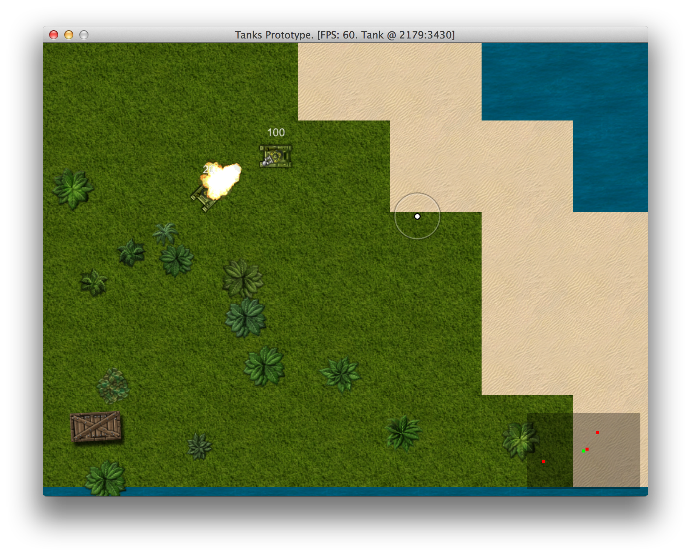

# Making The Prototype Playable

Right now we have a somewhat playable, but boring prototype without any scores or winning
conditions. You can just run around and shoot other tanks. Nobody would play a game like this,
hence we need to to add the missing parts. There is a crazy amount of them. It is time to give it a
thorough play through and write down all the ideas and pain points about the prototype.

Here is my list:

1. Enemy tanks do not respawn.
2. Enemy tanks shoot at my current location, not at where I will be when bullet
hits me.
3. Enemy tanks don't avoid collisions.
4. Random maps are boring and lack detail, could use more tiles or random environment objects.
5. Bullets are hard to see on green surface.
6. Hard to tell where enemies are coming from, radar would help.
7. Sounds play at full volume even when something happens across the whole map.
8. My tank should respawn after it's dead.
9. Motion and firing mechanics seem clumsy.
10. Map boundaries are visible when you come to the edge.
11. Enemy tank movement patterns need polishing and improvement.

This will keep us busy for a while, but in the end we will probably have something that will
hopefully be able to entertain people for more than 3 minutes.

## Drawing Water Beyond Map Boundaries

We don't want to see darkness when we come to the edge of game world. Luckily, it is a trivial fix.
In `Map#draw` we check if tile exists in map before drawing it. When tile does not exist, we can
draw water instead. And we can always fallback to water tile in `Map#tile_at`:

{line-numbers="off"}
~~~~~~~~
class Map
  # ...
  def draw(viewport)
    viewport.map! { |p| p / TILE_SIZE }
    x0, x1, y0, y1 = viewport.map(&:to_i)
    (x0..x1).each do |x|
      (y0..y1).each do |y|
        row = @map[x]
        map_x = x * TILE_SIZE
        map_y = y * TILE_SIZE
        if row
          tile = @map[x][y]
          if tile
            tile.draw(map_x, map_y, 0)
          else
            @water.draw(map_x, map_y, 0)
          end
        else
          @water.draw(map_x, map_y, 0)
        end
      end
    end
  end
  # ...
  private
  # ...
  def tile_at(x, y)
    t_x = ((x / TILE_SIZE) % TILE_SIZE).floor
    t_y = ((y / TILE_SIZE) % TILE_SIZE).floor
    row = @map[t_x]
    row ? row[t_y] : @water
  end
  # ...
end
~~~~~~~~

Now the edge looks much better:

## Generating Tree Clusters

To make the map more fun to play at, we will generate some trees. Let's start with `Tree` class:

<<[09-polishing/entities/tree.rb](code/09-polishing/entities/tree.rb)

Nothing fancy here, we want it to shake on collision, and it has graphics and health. `seed` will
used to generate clusters of similar trees. Let's take a look at `TreeGraphics`:

<<[09-polishing/entities/components/tree_graphics.rb](code/09-polishing/entities/components/tree_graphics.rb)

Shaking is probably the most interesting part here. When `shake` is called, graphics will start
drawing tree shifted in given direction by amount defined in `SHAKE_DISTANCE` array. `draw` will be
stepping through `SHAKE_DISTANCE` depending on `SHAKE_TIME`, and it will not be shaken again for
`SHAKE_COOLDOWN` period, to avoid infinite shaking while driving into it.

We also need some adjustments to `TankPhysics` and `Tank` to be able to hit trees. First, we want
to create an empty `on_collision(object)` method in `GameObject` class, so all game objects will
be able to collide.

Then, `TankPhysics` starts calling `Tank#on_collision` when collision is detected:

{line-numbers="off"}
~~~~~~~~
class Tank < GameObject
  # ...
  def on_collision(object)
    return unless object
    # Avoid recursion
    if object.class == Tank
      # Inform AI about hit
      object.input.on_collision(object)
    else
      # Call only on non-tanks to avoid recursion
      object.on_collision(self)
    end
    # Bullets should not slow Tanks down
    if object.class != Bullet
      @sounds.collide if @physics.speed > 1
    end
  end
  # ...
end
~~~~~~~~

The final ingredient to our `Tree` is `Health`, which is extracted from `TankHealth` to reduce
duplication. `TankHealth` now extends it:

<<[09-polishing/entities/components/health.rb](code/09-polishing/entities/components/health.rb)

Yes, you can make tree explode when it's destroyed. And it causes cool chain reactions blowing up
whole tree clusters. But let's not do that, because we will add something more appropriate for
explosions.

Our `Tree` is ready to fill the landscape. We will do it in `Map` class, which will now need
to know about `ObjectPool`, because trees will go there.

{line-numbers="off"}
~~~~~~~~
class Map
  # ...
  def initialize(object_pool)
    load_tiles
    @object_pool = object_pool
    object_pool.map = self
    @map = generate_map
    generate_trees
  end
  # ...
  def generate_trees
    noises = Perlin::Noise.new(2)
    contrast = Perlin::Curve.contrast(
      Perlin::Curve::CUBIC, 2)
    trees = 0
    target_trees = rand(300..500)
    while trees < target_trees do
      x = rand(0..MAP_WIDTH * TILE_SIZE)
      y = rand(0..MAP_HEIGHT * TILE_SIZE)
      n = noises[x * 0.001, y * 0.001]
      n = contrast.call(n)
      if tile_at(x, y) == @grass && n > 0.5
        Tree.new(@object_pool, x, y, n * 2 - 1)
        trees += 1
      end
    end
  end
  # ...
end
~~~~~~~~

Perlin noise is used in similar fashion as it was when we generated map tiles. We allow creating
trees only if noise level is above `0.5`, and use noise level as seed value - `n * 2 - 1` will be a
number between 0 and 1 when `n` is in `0.5..1` range. And we only allow creating trees on grass
tiles.

Now our map looks a little better:

## Generating Random Objects

Trees are great, but we want more detail. Let's spice things up with explosive boxes and barrels.
They will be using the same class with single sprite sheet, so while the sprite will be chosen
randomly, behavior will be the same. This new class will be called `Box`:

<<[09-polishing/entities/box.rb](code/09-polishing/entities/box.rb)

It will be generated with slight random angle, to preserve realistic shadows but give an impression
of chaotic placement. Tanks will also be able to push boxes a little on collision, but only when
going fast enough. `Health` component is the same one that `Tree` has, but initialized with less
health and explosive flag is `true`, so the box will blow up after one hit and deal extra damage to
the surroundings.

`BoxGraphics` is nothing fancy, it just loads random sprite upon initialization:

<<[09-polishing/entities/components/box_graphics.rb](code/09-polishing/entities/components/box_graphics.rb)

Time to generate boxes in our `Map`. It will be similar to trees, but we won't need Perlin noise,
since there will be way fewer boxes than trees, so we don't need to form patterns. All we need to
do is to check if we're not generating box on water.

{line-numbers="off"}
~~~~~~~~
class Map
  # ...
  def initialize(object_pool)
    # ...
    generate_boxes
  end
  # ...
  def generate_boxes
    boxes = 0
    target_boxes = rand(10..30)
    while boxes < target_boxes do
      x = rand(0..MAP_WIDTH * TILE_SIZE)
      y = rand(0..MAP_HEIGHT * TILE_SIZE)
      if tile_at(x, y) != @water
        Box.new(@object_pool, x, y)
        boxes += 1
      end
    end
  end
  # ...
end
~~~~~~~~

Now give it a go. Beautiful, isn't it?

## Implementing A Radar

With all the visual noise it is getting increasingly difficult to see enemy tanks. That's why we
will implement a `Radar` to help ourselves.

<<[09-polishing/entities/radar.rb](code/09-polishing/entities/radar.rb)

`Radar`, like `Camera`, also has a target. It uses `ObjectPool` to query nearby objects and filters
out instances of alive `Tank`. Then it draws a transparent black background and small dots for each
tank, green for target, red for the rest.

To avoid querying `ObjectPool` too often, `Radar` updates itself only once every second.

It is initialized, updated and drawn in `PlayState`, right after `Camera`:

{line-numbers="off"}
~~~~~~~~
class PlayState < GameState
  # ...
  def initialize
    # ...
    @camera.target = @tank
    @radar = Radar.new(@object_pool, @tank)
    # ...
  end
  # ...
  def update
    # ...
    @camera.update
    @radar.update
    # ...
  end
  # ...
  def draw
    # ...
    @camera.draw_crosshair
    @radar.draw
  end
  # ...
end
~~~~~~~~

Time to enjoy the results.

