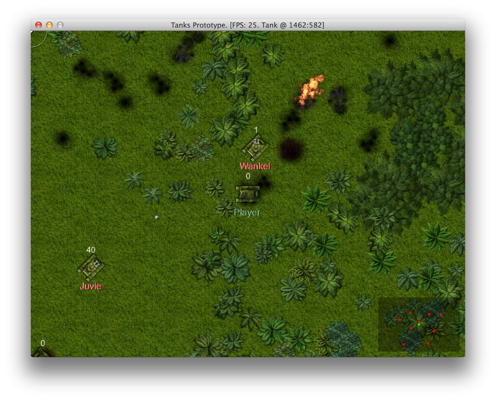
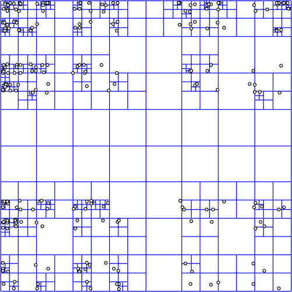
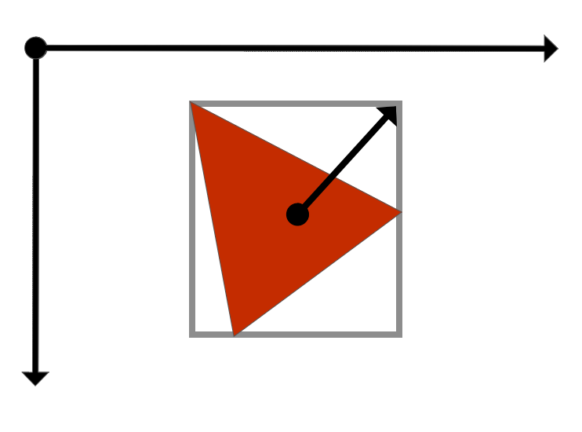
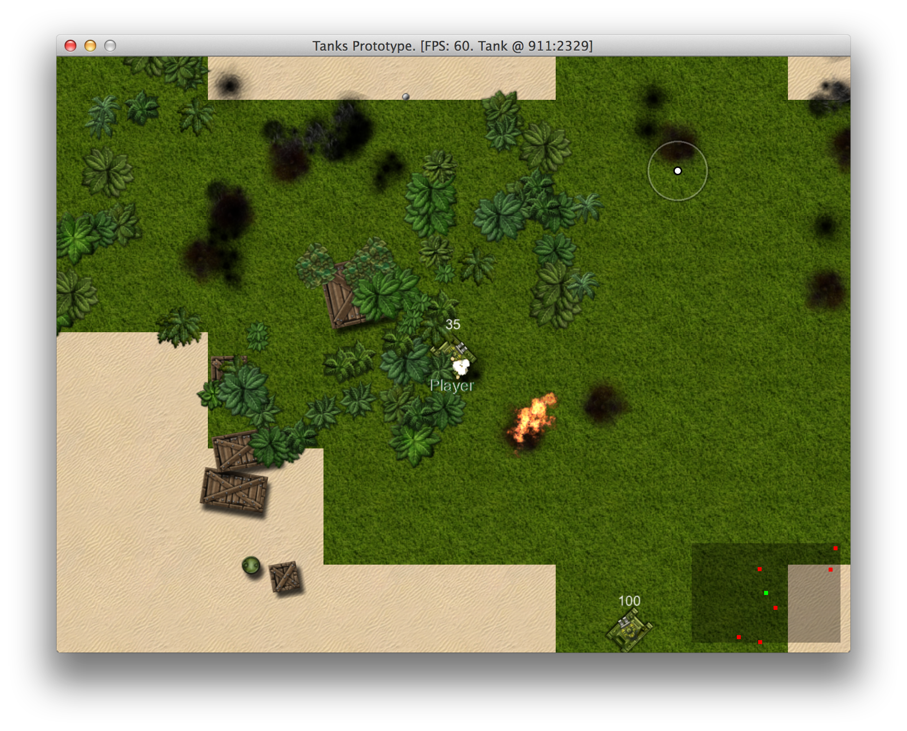

# Dealing With Thousands Of Game Objects

Gosu is blazing fast when it comes to drawing, but there are more things going on. Namely, we use
`ObjectPool#nearby` quite often to loop through thousands of objects 60 times per
second to measure distances among them. This slows everything down when object pool grows.

To demonstrate the effect, we will generate 1500 trees, 30 tanks, ~100 boxes and leave 1000 damage
trails from explosions. It was enough to drop FPS below 30:

## Spatial Partitioning

There is a solution for this particular problem is "Spatial Partitioning", and the
essence of it is that you have to use a tree-like data structure that divides space into regions,
places objects there and lets you query itself in
[logarithmic time](http://en.wikipedia.org/wiki/Logarithmic_time#Logarithmic_time), omitting
objects that fall out of query region. Spatial Partitioning is explained well in
[Game Programming Patterns](http://gameprogrammingpatterns.com/spatial-partition.html).

Probably the most appropriate data structure for our 2D game is
[quadtree](http://en.wikipedia.org/wiki/Quadtree). To quote Wikipedia, "quadtrees are most often
used to partition a two-dimensional space by recursively subdividing it into four quadrants or
regions." Here is how it looks like:

## Implementing A Quadtree

There are some implementations of quadtree available for Ruby -
[rquad](https://github.com/cantino/rquad),
[rubyquadtree](https://github.com/danielgrigg/rubyquadtree) and
[rubyquad](https://github.com/bhelx/rubyquad), but it seems easy to implement, so we will build one
tailored (read: closely coupled) to our game using the pseudo code from Wikipedia.

### Axis Aligned Bounding Box

One of prerequisites of quadtree is [Axis aligned bounding
box](http://en.wikipedia.org/wiki/Minimum_bounding_box#Axis-aligned_minimum_bounding_box),
sometimes referred to as "AABB". It is simply a box that surrounds the shape but has edges that are
in parallel with the axes of underlying coordinate system. The advantage of this box is that it
gives a rough estimate where the shape is and is very efficient when it comes to querying if a
point is inside or outside it.

To define axis aligned bounding box, we need it's center point and half dimension vector, which
points from center point to one of the corners of the box, and two methods, one that tells if AABB
contains a point, and one that tells if AABB intersects with another AABB. This is how our
implementation looks like:

<<[10-partitioning/misc/axis_aligned_bounding_box.rb](code/10-partitioning/misc/axis_aligned_bounding_box.rb)

If you dig in `10-partitioning/specs`, you will find tests for this implementation too.

The math used in `AxisAlignedBoundingBox#contains?` and `AxisAlignedBoundingBox#intersects?` is
fairly simple and hopefully very fast, because these methods will be called billions of times
throughout the game.

### QuadTree For Game Objects

To implement the glorious `QuadTree` itself, we need to initialize it with boundary, that is
defined by an instance of `AxisAlignedBoundingBox` and provide methods for inserting, removing and
querying the tree. Private `QuadTree#subdivide` method will be called when we try to `insert` an
object into a tree that has more objects than it's `NODE_CAPACITY`.

<<[10-partitioning/misc/quad_tree.rb](code/10-partitioning/misc/quad_tree.rb)

This is a vanilla quadtree that stores instances of `GameObject` and uses `GameObject#location` for
indexing objects in space. It also has specs that you can find in code samples.

You can experiment with `QuadTree#NODE_CAPACITY`, but I found that values between 8 and 16 works
best, so I settled with 12.

## Integrating ObjectPool With QuadTree

We have implemented a `QuadTree`, but it is not yet incorporated into our game. To do that, we will
hook it into `ObjectPool` and try to keep the old interface intact, so that `ObjectPool#nearby`
will still work as usual, but will be able to cope with way more objects than before.

<<[10-partitioning/entities/object_pool.rb](code/10-partitioning/entities/object_pool.rb)

An old fashioned array of all objects is still used, because we still need to loop through
everything and invoke `GameObject#update`. `ObjectPool#query_range` was introduced to quickly grab
objects that have to be rendered on screen, and `ObjectPool#nearby` now queries tree and measures
distances only on rough result set.

This is how we will render things from now on:

{line-numbers="off"}
~~~~~~~~
class PlayState < GameState
  # ...
  def draw
    cam_x = @camera.x
    cam_y = @camera.y
    off_x =  $window.width / 2 - cam_x
    off_y =  $window.height / 2 - cam_y
    viewport = @camera.viewport
    x1, x2, y1, y2 = viewport
    box = AxisAlignedBoundingBox.new(
      [x1 + (x2 - x1) / 2, y1 + (y2 - y1) / 2],
      [x1 - Map::TILE_SIZE, y1 - Map::TILE_SIZE])
    $window.translate(off_x, off_y) do
      zoom = @camera.zoom
      $window.scale(zoom, zoom, cam_x, cam_y) do
        @map.draw(viewport)
        @object_pool.query_range(box).map do |o|
          o.draw(viewport)
        end
      end
    end
    @camera.draw_crosshair
    @radar.draw
  end
  # ...
end
~~~~~~~~

## Moving Objects In QuadTree

There is one more errand we now have to take care of. Everything works fine when things are static,
but when tanks and bullets move, we need to update them in our `QuadTree`. That's why `ObjectPool`
has `tree_remove` and `tree_insert`, which are called from `GameObject#move`. From now on, the only
way to change object's location will be by using `GameObject#move`:

{line-numbers="off"}
~~~~~~~~
class GameObject
  attr_reader :x, :y, :location, :components
  def initialize(object_pool, x, y)
    @x, @y = x, y
    @location = [x, y]
    @components = []
    @object_pool = object_pool
    @object_pool.add(self)
  end

  def move(new_x, new_y)
    return if new_x == @x && new_y == @y
    @object_pool.tree_remove(self)
    @x = new_x
    @y = new_y
    @location = [new_x, new_y]
    @object_pool.tree_insert(self)
  end
  # ...
end
~~~~~~~~

At this point we have to go through all the game objects and change how they initialize their base
class and update `x` and `y` coordinates, but we won't cover that here. If in doubt, refer to code
at `10-partitioning`.

Finally, FPS is back to stable 60 and we can focus on gameplay again.

