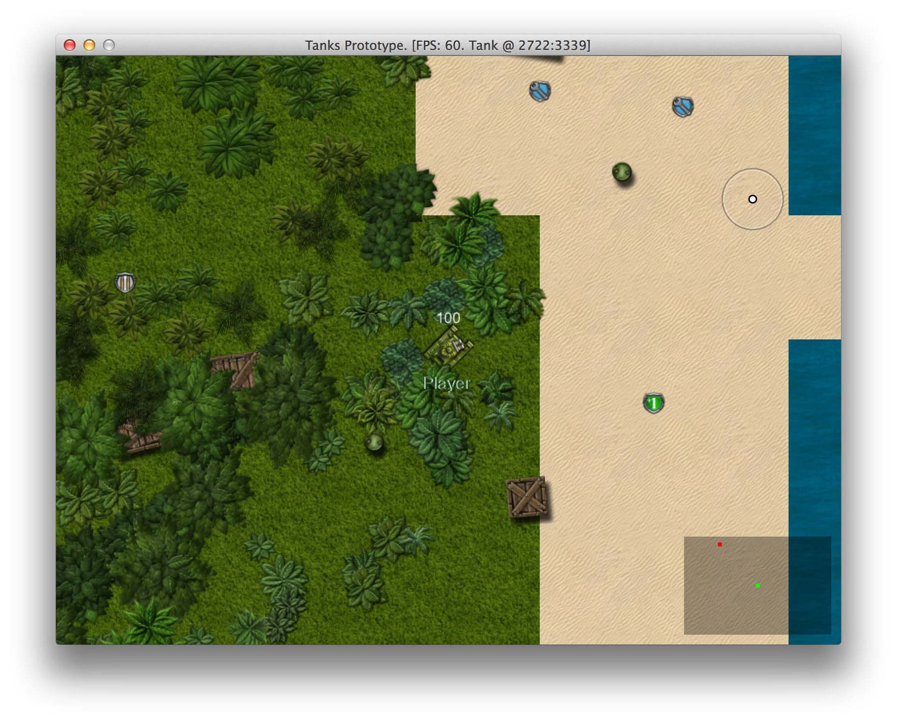

# Implementing Powerups

Game would become more strategic if there were ways to repair your damaged tank, boost it's speed
or increase rate of fire by picking up various powerups. This should not be too difficult to
implement. We will use some of [these images](http://opengameart.org/content/pickups-powerups):

For now, there will be four kinds of powerups:

1. **Repair damage.** Wrench badge will restore damaged tank's health back to 100 when picked up.
2. **Health boost.** Green +1 badge will add 25 health, up to 200 total, if you keep picking them up.
3. **Fire boost.** Double bullet badge will increase reload speed by 25%, up to 200% if you keep picking
them up.
4. **Speed boost.** Airplane badge will increase movement speed by 10%, up to 150% if you keep
picking them up

These powerups will be placed randomly around the map, and will automatically respawn 30 seconds after
pickup.

## Implementing Base Powerup

Before rushing forward to implement this, we have to do some research and think how to elegantly
integrate this into the whole game. First, let's agree that `Powerup` is a `GameObject`. It will
have graphics, sounds and it's coordinates. Effects can by applied by harnessing
`GameObject#on_collision` - when `Tank` collides with `Powerup`, it gets it.

<<[11-powerups/entities/powerups/powerup.rb](code/11-powerups/entities/powerups/powerup.rb)

Ignore `Powerup#remove`, we will get to it when implementing `PowerupRespawnQueue`. The rest should be
straightforward.

## Implementing Powerup Graphics

All powerups will use the same sprite sheet, so there could be a
single `PowerupGraphics` class that will be rendering given sprite type. We will use
`gosu-texture-packer` gem, since sprite sheet is conveniently packed already.

<<[11-powerups/entities/components/powerup_graphics.rb](code/11-powerups/entities/components/powerup_graphics.rb)

## Implementing Powerup Sounds

It's even simpler with sounds. All powerups will emit a mellow "bleep" when picked up, so
`PowerupSounds` can be completely static, like `ExplosionSounds` or `BulletSounds`:

<<[11-powerups/entities/components/powerup_sounds.rb](code/11-powerups/entities/components/powerup_sounds.rb)

## Implementing Repair Damage Powerup

Repairing broken tank is probably the most important powerup of them all, so let's implement it
first:

<<[11-powerups/entities/powerups/repair_powerup.rb](code/11-powerups/entities/powerups/repair_powerup.rb)

This was incredibly simple. `Health#restore` already existed since we had to respawn our tanks.
We can only hope other powerups are as simple to implement as this one.

## Implementing Health Boost

Repairing damage is great, but how about boosting some extra health for upcoming battles? Health
boost to the rescue:

<<[11-powerups/entities/powerups/health_powerup.rb](code/11-powerups/entities/powerups/health_powerup.rb)

This time we have to implement `Health#increase`, but it is pretty simple:

{line-numbers="off"}
~~~~~~~~
class Health < Component
  # ...
  def increase(amount)
    @health = [@health + 25, @initial_health * 2].min
    @health_updated = true
  end
  # ...
end
~~~~~~~~

Since `Tank` has `@initial_health` equal to 100, increasing health won't go over 200, which is
exactly what we want.

## Implementing Fire Rate Boost

How about boosting tank's fire rate?

<<[11-powerups/entities/powerups/fire_rate_powerup.rb](code/11-powerups/entities/powerups/fire_rate_powerup.rb)

We need to introduce `@fire_rate_modifier` in `Tank` class and use it when calling
`Tank#can_shoot?`:

{line-numbers="off"}
~~~~~~~~
class Tank < GameObject
  # ...
  attr_accessor :fire_rate_modifier
  # ...
  def can_shoot?
    Gosu.milliseconds - (@last_shot || 0) >
      (SHOOT_DELAY / @fire_rate_modifier)
  end
  # ...
  def reset_modifiers
    @fire_rate_modifier = 1
  end
  # ...
end
~~~~~~~~

`Tank#reset_modifier` should be called when respawning, since we want tanks to lose their powerups
when they die. It can be done in `TankHealth#after_death`:

{line-numbers="off"}
~~~~~~~~
class TankHealth < Health
  # ...
  def after_death
    object.reset_modifiers
    # ...
  end
end
~~~~~~~~

## Implementing Tank Speed Boost

Tank speed boost is very similar to fire rate powerup:

<<[11-powerups/entities/powerups/tank_speed_powerup.rb](code/11-powerups/entities/powerups/tank_speed_powerup.rb)

We have to add `@speed_modifier` to `Tank` class and use it in `TankPhysics#update` when calculating
movement distance.

{line-numbers="off"}
~~~~~~~~
# 11-powerups/entities/tank.rb
class Tank < GameObject
  # ...
  attr_accessor :speed_modifier
  # ...
  def reset_modifiers
    # ...
    @speed_modifier = 1
  end
  # ...
end

# 11-powerups/entities/components/tank_physics.rb
class TankPhysics < Component
  # ...
  def update
    # ...
      new_x, new_y = x, y
      speed = apply_movement_penalty(@speed)
      shift = Utils.adjust_speed(speed) * object.speed_modifier
    # ...
  end
  # ...
end
~~~~~~~~

`Camera#update` has also refer to `Tank#speed_modifier`, otherwise the operator will fail to catch
up and camera will be lagging behind.

{line-numbers="off"}
~~~~~~~~
class Camera
  # ...
  def update
    # ...
    shift = Utils.adjust_speed(
      @target.physics.speed).floor *
      @target.speed_modifier + 1
    # ...
  end
  # ...
end
~~~~~~~~

## Spawning Powerups On Map

Powerups are implemented, but not yet spawned. We will spawn 20 - 30 random powerups when
generating the map:

{line-numbers="off"}
~~~~~~~~
class Map
  # ...
  def initialize(object_pool)
    # ...
    generate_powerups
  end
  # ...
  def generate_powerups
    pups = 0
    target_pups = rand(20..30)
    while pups < target_pups do
      x = rand(0..MAP_WIDTH * TILE_SIZE)
      y = rand(0..MAP_HEIGHT * TILE_SIZE)
      if tile_at(x, y) != @water
        random_powerup.new(@object_pool, x, y)
        pups += 1
      end
    end
  end

  def random_powerup
    [HealthPowerup,
     RepairPowerup,
     FireRatePowerup,
     TankSpeedPowerup].sample
  end
  # ...
end
~~~~~~~~

The code is very similar to generating boxes. It's probably not the best way to distribute powerups
on map, but it will have to do for now.

## Respawning Powerups After Pickup

When we pick up a powerup, we want it to reappear in same spot 30 seconds later. A thought "we can
start a new `Thread` with `sleep` and initialize the same powerup there" sounds very bad, but I had
it for a few seconds. Then `PowerupRespawnQueue` was born.

First, let's recall how `Powerup#remove` method looks like:

{line-numbers="off"}
~~~~~~~~
class Powerup < GameObject
  # ...
  def remove
    object_pool.powerup_respawn_queue.enqueue(
      respawn_delay,
      self.class, x, y)
    mark_for_removal
  end
  # ...
end
~~~~~~~~

Powerup enqueues itself for respawn when picked up, providing it's class and coordinates.
`PowerupRespawnQueue` holds this data and respawns powerups at right time with help of
`ObjectPool`:

<<[11-powerups/entities/powerups/powerup_respawn_queue.rb](code/11-powerups/entities/powerups/powerup_respawn_queue.rb)

`PowerupRespawnQeueue#respawn` is called from `ObjectPool#update_all`, but is throttled to run once per second for better performance.

{line-numbers="off"}
~~~~~~~~
class ObjectPool
  # ...
  attr_accessor :powerup_respawn_queue
  # ...
  def update_all
    # ...
    @powerup_respawn_queue.respawn(self)
  end
  # ...
end
~~~~~~~~

This is it, the game should now contain randomly placed powerups that respawn 30 seconds after
picked up. Time to enjoy the result.

We haven't done any changes to AI though, that means enemies will only be picking those powerups by
accident, so now you have a significant advantage and the game has suddenly became too easy to
play. Don't worry, we will be fixing that when overhauling the AI.
