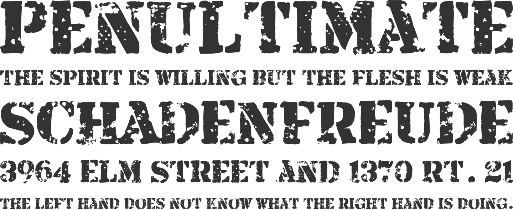

# Implementing Heads Up Display

In order to know what's happening, we need some sort of HUD. We already have crosshair and radar,
but they are scattered around in code. Now we want to display active powerup modifiers, so you
would know what is your fire rate and speed, and if it's worth getting one more powerup before
going into the next fight.

## Design Considerations

While creating our HUD class, we will have to start building game stats, because we want to display
number of kills our tank made. Stats topic will be covered in depth later, but for now let's assume
that `@tank.input.stats.kills` gives us the kill count, which we want to draw in top-left corner of
the screen, along with player health and modifier values.

HUD will also be responsible for drawing crosshair and radar.

## Rendering Text With Custom Font

Previously, all text were rendered with `Gosu.default_font_name`, and we want something more fancy
and more thematic, probably a dirty stencil based font like [this
one](http://www.fontsquirrel.com/fonts/Armalite-Rifle):

To have convenient access to this font, we will add a helper method in `Utils`:

{line-numbers="off"}
~~~~~~~~
module Utils
  # ...
  def self.title_font
    media_path('armalite_rifle.ttf')
  end
  # ...
end
~~~~~~~~

Use it instead of `Gosu.default_font_name`:

{line-numbers="off"}
~~~~~~~~
size = 20
Gosu::Image.from_text($window, "Your text", Utils.main_font, size)
~~~~~~~~

## Implementing HUD Class

After we have put everything together, we will get `HUD` class:

<<[12-hud/entities/hud.rb](code/12-hud/entities/hud.rb)

To use it, we need to hook into `PlayState`:

{line-numbers="off"}
~~~~~~~~
class PlayState < GameState
  # ...
  def initialize
    # ...
    @hud = HUD.new(@object_pool, @tank)
  end

  def update
    # ...
    @hud.update
  end

  def draw
    # ...
    @hud.draw
  end
  # ...
end
~~~~~~~~

Assuming you have mocked `@tank.input.stats.kills` in `HUD`, you should get a neat view showing
interesting things in top-left corner of the screen:

# Tracking Kills, Deaths and Damage

TODO

