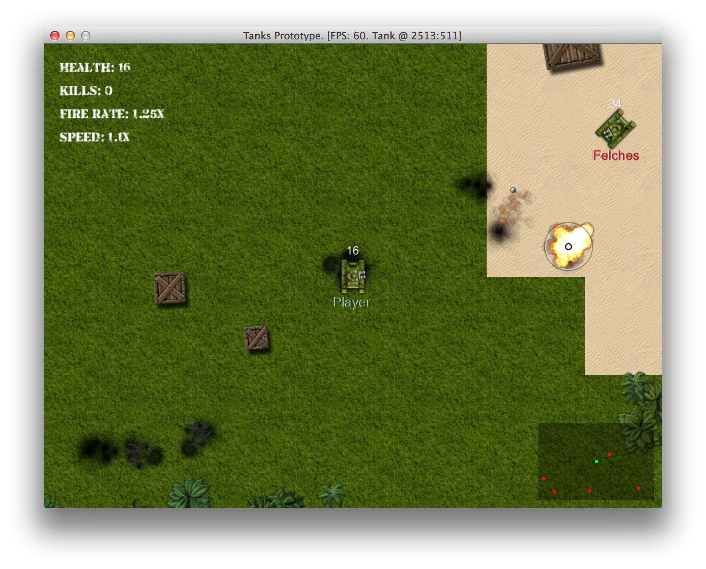
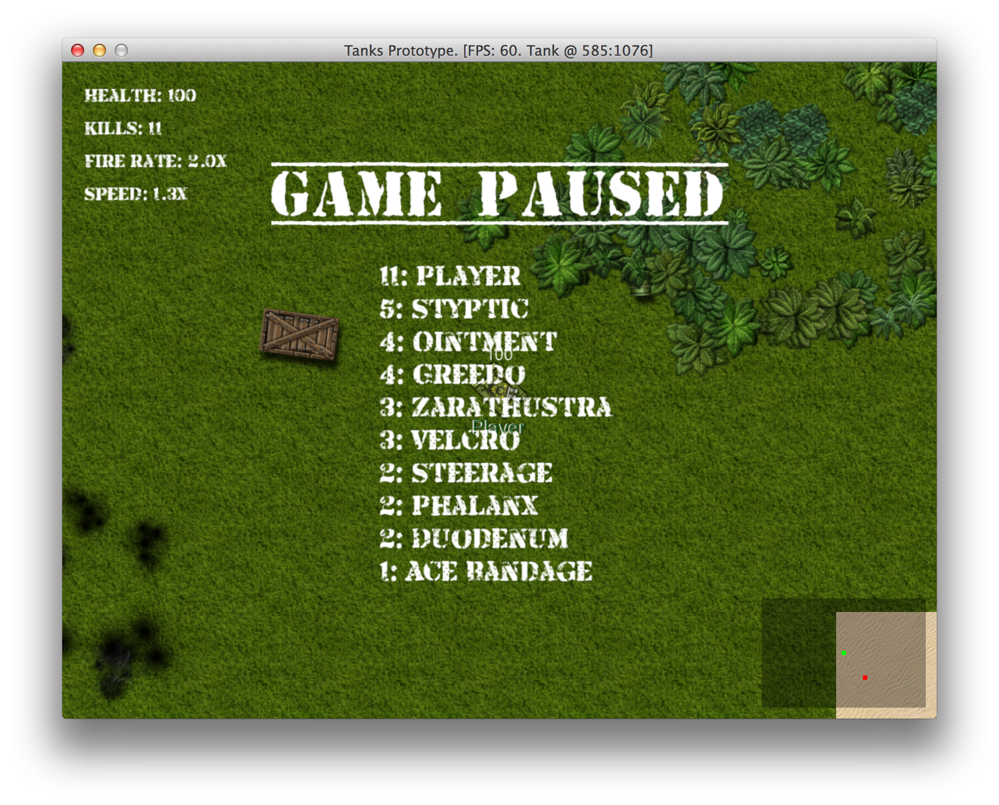

# Implementing Heads Up Display

In order to know what's happening, we need some sort of HUD. We already have crosshair and radar,
but they are scattered around in code. Now we want to display active powerup modifiers, so you
would know what is your fire rate and speed, and if it's worth getting one more powerup before
going into the next fight.

## Design Considerations

While creating our HUD class, we will have to start building game stats, because we want to display
number of kills our tank made. Stats topic will be covered in depth later, but for now let's assume
that `@tank.input.stats.kills` gives us the kill count, which we want to draw in top-left corner of
the screen, along with player health and modifier values.

HUD will also be responsible for drawing crosshair and radar.

## Rendering Text With Custom Font

Previously, all text were rendered with `Gosu.default_font_name`, and we want something more fancy
and more thematic, probably a dirty stencil based font like [this
one](http://www.fontsquirrel.com/fonts/Armalite-Rifle):

And one more fancy font will make our game title look good. Too bad we don't have a title yet, but
"Tanks Prototype" writen in a thematic way still looks pretty good.

To have convenient access to these fonts, we will add a helper methods in `Utils`:

{line-numbers="off"}
~~~~~~~~
module Utils
  # ...
  def self.title_font
    media_path('top_secret.ttf')
  end

  def self.main_font
    media_path('armalite_rifle.ttf')
  end
  # ...
end
~~~~~~~~

Use it instead of `Gosu.default_font_name`:

{line-numbers="off"}
~~~~~~~~
size = 20
Gosu::Image.from_text($window, "Your text", Utils.main_font, size)
~~~~~~~~

## Implementing HUD Class

After we have put everything together, we will get `HUD` class:

<<[12-stats/entities/hud.rb](code/12-stats/entities/hud.rb)

To use it, we need to hook into `PlayState`:

{line-numbers="off"}
~~~~~~~~
class PlayState < GameState
  # ...
  def initialize
    # ...
    @hud = HUD.new(@object_pool, @tank)
  end

  def update
    # ...
    @hud.update
  end

  def draw
    # ...
    @hud.draw
  end
  # ...
end
~~~~~~~~

Assuming you have mocked `@tank.input.stats.kills` in `HUD`, you should get a neat view showing
interesting things in top-left corner of the screen:

# Implementing Game Statistics

Games like one we are building are all about competition, and you cannot compete if you don't know
the score. Let us introduce a class that will be responsible for keeping tabs on various statistics
of every tank.

<<[12-stats/misc/stats.rb](code/12-stats/misc/stats.rb)

While building the `HUD`, we established that `Stats` should belong to `Tank#input`, because it
defines who is controlling the tank. So, every instance of `PlayerInput` and `AiInput` has to have
it's own `Stats`:

{line-numbers="off"}
~~~~~~~~
# 12-stats/entities/components/player_input.rb
class PlayerInput < Component
  # ...
  attr_reader :stats

  def initialize(name, camera, object_pool)
    # ...
    @stats = Stats.new(name)
  end
  # ...
  def on_damage(amount)
    @stats.add_damage(amount)
  end
  # ...
end

# 12-stats/entities/components/ai_input.rb
class AiInput < Component
  # ...
  attr_reader :stats

  def initialize(name, object_pool)
    # ...
    @stats = Stats.new(name)
  end

  def on_damage(amount)
    # ...
    @stats.add_damage(amount)
  end
end
~~~~~~~~

That itch to extract a base class from `PlayerInput` and `AiInput` is getting stronger, but we will
have to resist the urge, for now.

## Tracking Kills, Deaths and Damage

To begin tracking kills, we need to know whom does every bullet belong to. `Bullet` already has
`source` attribute, which contains the tank that fired it, there will be no trouble to find out who
was the shooter when bullet gets a direct hit. But how about explosions? Bullets that hit the
ground nearby a tank deals indirect damage from the explosion.

Solution is simple, we need to pass the `source` of the `Bullet` to the `Explosion` when it's being
initialized.

{line-numbers="off"}
~~~~~~~~
class Bullet < GameObject
  # ...
  def explode
    Explosion.new(object_pool, @x, @y, @source)
    # ...
  end
  # ...
end
~~~~~~~~

## Making Damage Personal

Now that we have the source of every `Bullet` and `Explosion` they trigger, we can start passing
the cause of damage to `Health#inflict_damage` and incrementing the appropriate stats.

{line-numbers="off"}
~~~~~~~~
# 12-stats/entities/components/health.rb
class Health < Component
  # ...
  def inflict_damage(amount, cause)
    if @health > 0
      @health_updated = true
      if object.respond_to?(:input)
        object.input.stats.add_damage(amount)
        # Don't count damage to trees and boxes
        if cause.respond_to?(:input) && cause != object
          cause.input.stats.add_damage_dealt(amount)
        end
      end
      @health = [@health - amount.to_i, 0].max
      after_death(cause) if dead?
    end
  end
  # ...
end

# 12-stats/entities/components/tank_health.rb
class TankHealth < Health
  # ...
  def after_death(cause)
    # ...
    object.input.stats.add_death
    kill = object != cause ? 1 : -1
    cause.input.stats.add_kill(kill)
    # ...
  end
# ...
end
~~~~~~~~

## Tracking Damage From Chain Reactions

There is one more way to cause damage. When you shoot a tree, box or barrel, it explodes, probably
triggering a chain reaction of explosions around it. If those explosions kill somebody, it would
only be fair to account that kill for the tank that triggered this chain reaction.

To solve this, simply pass the cause of death to the `Explosion` that gets triggered afterwards.

{line-numbers="off"}
~~~~~~~~
# 12-stats/entities/components/health.rb
class Health < Component
  # ...
  def after_death(cause)
    if @explodes
      Thread.new do
        # ...
        Explosion.new(@object_pool, x, y, cause)
        # ...
      end
      # ...
    end
  end
end

# 12-stats/entities/components/tank_health.rb
class TankHealth < Health
  # ...
  def after_death(cause)
    # ...
    Thread.new do
      # ...
      Explosion.new(@object_pool, x, y, cause)
    end
  end
end
~~~~~~~~

Now every bit of damage gets accounted for.

## Displaying Game Score

Having all the data is useless unless we display it somehow. For this, let's rethink our game
states. Now we have `MenuState` and `PlayState`. Both of them can switch one into another. What if
we introduced a `PauseState`, which would freeze the game and display the list of all tanks along
with their kills. Then `MenuState` would switch to `PlayState`, and from `PlayState` you would be
able to get to `PauseState`.

Let's begin by implementing `ScoreDisplay`, that would print a sorted list of tank kills along with
their names.

<<[12-stats/entities/score_display.rb](code/12-stats/entities/score_display.rb)

We will have to initialize `ScoreDisplay` every time when we want to show the updated score. Time
to create the `PauseState` that would show the score.

<<[12-stats/game_states/pause_state.rb](code/12-stats/game_states/pause_state.rb)

You will notice that `PauseState` invokes `PlayState#draw`, but without `PlayState#update` this
will be a still image. We make sure we hide the crosshair and restore previous mouse location when
resuming play state. That way player would not be able to cheat by pausing the game, targeting the
tank while nothing moves and then unpausing ready to deal damage. Our `HUD` had `attr_accessor
:active` exactly for this reason, but we need to switch it on and off in `PlayState#enter` and
`PlayState#leave`.

{line-numbers="off"}
~~~~~~~~
class PlayState < GameState
  # ...
  def button_down(id)
    # ...
    if id == Gosu::KbEscape
      pause = PauseState.instance
      pause.play_state = self
      GameState.switch(pause)
    end
    # ...
  end
  # ...
  def leave
    StereoSample.stop_all
    @hud.active = false
  end

  def enter
    @hud.active = true
  end
  # ...
end
~~~~~~~~

Time for a test drive.

For now, scoring most kills is relatively simple. This should change when we will tell enemy AI
to collect powerups when appropriate.

