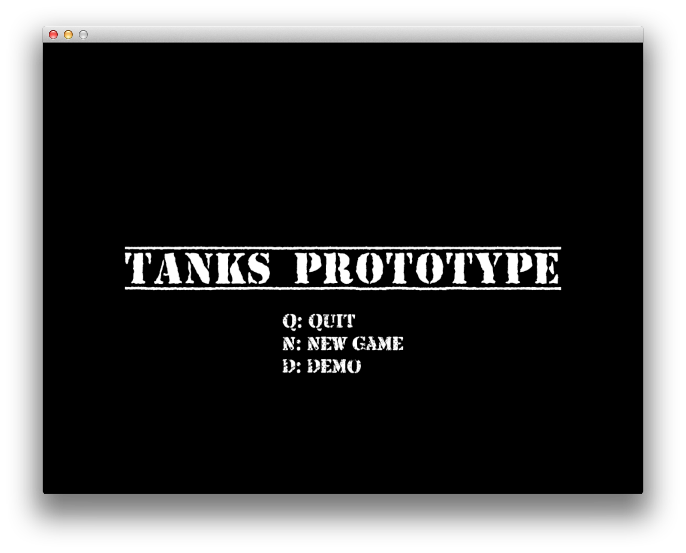
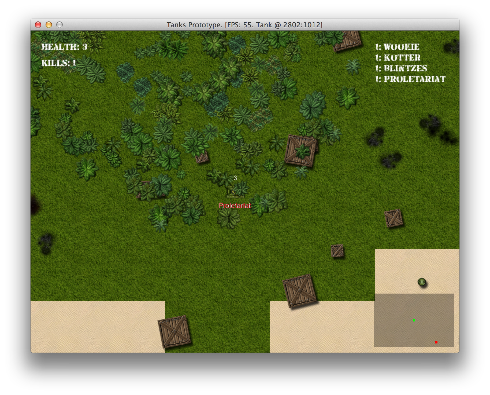

# Building Advanced AI

The AI we have right now can kick some ass, but it is too dumb for any seasoned gamer to compete
with. This is the list of current flaws:

1. It does not navigate well, gets stuck among trees or somewhere near water.
2. It is not aware of powerups.
3. It could do better job at shooting.
4. It's field of vision is too small, compared to player's, who is equipped with radar.

We will tackle these issues in current chapter.

## Improving Tank Navigation

Tanks shouldn't behave like Roombas, randomly driving around and bumping into things. They could be
navigating like this:

1. Consult with current AI state and find or update destination point.
2. If destination has changed, calculate shortest path to destination.
3. Move along the calculated path.
4. Repeat.

If this looks easy, let me assure you, it would probably require rewriting the majority of `AI` and
`Map` code we have at this point, and it is pretty tricky to implement with procedurally generated
maps, because normally you would use a map editor to set up waypoints, navigation mesh or other
hints for AI so it doesn't get stuck. Sometimes it is better to have something working imperfectly
over a perfect solution that never happens, thus we will use simple things that will make as much
impact as possible without rewriting half of the code.

### Generating Friendlier Maps

One of main reasons why tanks get stuck is bad placement of spawn points. They don't take trees and
boxes into account, so enemy tank can spawn in the middle of a forest, with no chance of getting
out without blowing things up. A simple fix would be to consult with `ObjectPool` before placing a
spawn point only where there are no other game objects around in, say, 150 pixel radius:

{line-numbers="off"}
~~~~~~~~
class Map
  # ...
  def find_spawn_point
    while true
      x = rand(0..MAP_WIDTH * TILE_SIZE)
      y = rand(0..MAP_HEIGHT * TILE_SIZE)
      if can_move_to?(x, y) &&
          @object_pool.nearby_point(x, y, 150).empty?
        return [x, y]
      end
    end
  end
  # ...
end
~~~~~~~~

How about powerups? They can also spawn in the middle of a forest, and while tanks are not seeking
them yet, we will be implementing this behavior, and leading tanks into wilderness of trees is not
the best idea ever. Let's fix it too:

{line-numbers="off"}
~~~~~~~~
class Map
  # ...
  def generate_powerups
    pups = 0
    target_pups = rand(20..30)
    while pups < target_pups do
      x = rand(0..MAP_WIDTH * TILE_SIZE)
      y = rand(0..MAP_HEIGHT * TILE_SIZE)
      if tile_at(x, y) != @water &&
          @object_pool.nearby_point(x, y, 150).empty?
        random_powerup.new(@object_pool, x, y)
        pups += 1
      end
    end
  end
  # ...
end
~~~~~~~~

We could also reduce tree count, but that would make the map look worse, so we are going to keep
this in our pocket as a mean of last resort.

## Implementing Demo State To Observe AI

Probably the best way to figure out if our AI is any good is to target one of AI tanks with our
game camera and see how it plays. It will give us a great visual testing tool that will allow
tweaking AI settings and seeing if they perform better or worse. For that we will introduce
`DemoState` where only AI tanks will be present in the map, and we will be able to switch camera
from one tank to another.

`DemoState` is very similar to `PlayState`, the main difference is that there is no player. We will
extract `create_tanks` method that will be overridden in `DemoState`.

{line-numbers="off"}
~~~~~~~~
class PlayState < GameState
  attr_accessor :update_interval, :object_pool, :tank

  def initialize
    # ...
    @camera = Camera.new
    @object_pool.camera = @camera
    create_tanks(4)
  end
  # ...
  private

  def create_tanks(amount)
    @map.spawn_points(amount * 3)
    @tank = Tank.new(@object_pool,
      PlayerInput.new('Player', @camera, @object_pool))
    amount.times do |i|
      Tank.new(@object_pool, AiInput.new(
        @names.random, @object_pool))
    end
    @camera.target = @tank
    @hud = HUD.new(@object_pool, @tank)
  end
  # ...
end
~~~~~~~~

We will also want to display a smaller version of score in top-right corner of the screen, so let's
add some adjustments to `ScoreDisplay`:

{line-numbers="off"}
~~~~~~~~
class ScoreDisplay
  def initialize(object_pool, font_size=30)
    @font_size = font_size
    # ...
  end

  def create_stats_image(stats)
    # ...
    @stats_image = Gosu::Image.from_text(
      $window, text, Utils.main_font, @font_size)
  end
  # ...
  def draw_top_right
    @stats_image.draw(
      $window.width - @stats_image.width - 20,
      20,
      1000)
  end
end
~~~~~~~~

And here is the extended `DemoState`:

<<[13-advanced-ai/game_states/demo_state.rb](code/13-advanced-ai/game_states/demo_state.rb)

To have a possibility to enter `DemoState`, we need to change `MenuState` a little:

{line-numbers="off"}
~~~~~~~~
class MenuState < GameState
  # ...
  def update
    text = "Q: Quit\nN: New Game\nD: Demo"
    # ...
  end
  # ...
  def button_down(id)
    # ...
    if id == Gosu::KbD
      @play_state = DemoState.new
      GameState.switch(@play_state)
    end
  end
end
~~~~~~~~

Now, main menu has the option to enter demo state:

## Visual AI Debugging

After watching AI behavior in demo mode for a while, I was terrified. When playing game normally,
you usually see tanks in "fighting" state, which works pretty well, but when tanks go roaming, it's
a complete disaster. They get stuck easily, they don't go too far from the original location, they
wait too much.

Some things could be improved just by changing `wait_time`, `turn_time` and `drive_time` to
different values, but we certainly have to do bigger changes than that.

On the other hand, "observe AI in action, tweak, repeat" cycle proved to be very effective, I will
definitely use this technique in all my future games.

## Making AI Collect Powerups

To even out the odds, we have to make AI seek powerups when they are required. The logic behind it
can be implemented using a couple of simple steps:

1. AI would know what powerups are currently needed. This may vary from state to state, i.e. speed
and fire rate powerups are nice to have when roaming, but not that important when fleeing after
taking heavy damage. And we don't want AI to waste time and collect speed powerups when speed
modifier is already maxed out.
2. `AiVision` would return closest visible powerup, filtered by acceptable powerup types.
3. Some `TankMotionState` implementation would adjust tank direction towards closest visible
powerup in `change_direction` method.

### Finding Powerups In Sight

To implement changes in `AiVision`, we will introduce `closest_powerup` method. It will query
objects in sight and filter them out by their class and distance.

{line-numbers="off"}
~~~~~~~~
class AiVision
  # ...
  POWERUP_CACHE_TIMEOUT = 50
  # ...
  def closest_powerup(*suitable)
    now = Gosu.milliseconds
    @closest_powerup = nil
    if now - (@powerup_cache_updated_at ||= 0) > POWERUP_CACHE_TIMEOUT
      @closest_powerup = nil
      @powerup_cache_updated_at = now
    end
    @closest_powerup ||= find_closest_powerup(*suitable)
  end

  private

  def find_closest_powerup(*suitable)
    if suitable.empty?
      suitable = [FireRatePowerup,
                  HealthPowerup,
                  RepairPowerup,
                  TankSpeedPowerup]
    end
    @in_sight.select do |o|
      suitable.include?(o.class)
    end.sort do |a, b|
      x, y = @viewer.x, @viewer.y
      d1 = Utils.distance_between(x, y, a.x, a.y)
      d2 = Utils.distance_between(x, y, b.x, b.y)
      d1 <=> d2
    end.first
  end
  # ...
end
~~~~~~~~

It is very similar to `AiVision#closest_tank`, and parts should probably be extracted to keep the
code dry, but we will not bother.

### Seeking Powerups While Roaming

Roaming is when most picking should happen, because Tank sees no enemies in sight and needs to
prepare for upcoming battles. Let's see how can we implement this behavior while leveraging the
newly made `AiVision#closest_powerup`:

{line-numbers="off"}
~~~~~~~~
class TankRoamingState < TankMotionState
  # ...
  def required_powerups
    required = []
    health = @object.health.health
    if @object.fire_rate_modifier < 2 && health > 50
      required << FireRatePowerup
    end
    if @object.speed_modifier < 1.5 && health > 50
      required << TankSpeedPowerup
    end
    if health < 100
      required << RepairPowerup
    end
    if health < 190
      required << HealthPowerup
    end
    required
  end

  def change_direction
    closest_powerup = @vision.closest_powerup(
      *required_powerups)
    if closest_powerup
      @seeking_powerup = true
      angle = Utils.angle_between(
        @object.x, @object.y,
        closest_powerup.x, closest_powerup.y)
      @object.physics.change_direction(
        angle - angle % 45)
    else
      @seeking_powerup = false
      # ... choose random direction
    end
    @changed_direction_at = Gosu.milliseconds
    @will_keep_direction_for = turn_time
  end
  # ...
  def turn_time
    if @seeking_powerup
      rand(100..300)
    else
      rand(1000..3000)
    end
  end
end
~~~~~~~~

It is simple as that, and our AI tanks are now getting buffed on their spare time.

## Seeking Health Powerups After Heavy Damage

To seek health when damaged, we need to change `TankFleeingState#change_direction`:

{line-numbers="off"}
~~~~~~~~
class TankFleeingState < TankMotionState
  # ...
  def change_direction
    closest_powerup = @vision.closest_powerup(
      RepairPowerup, HealthPowerup)
    if closest_powerup
      angle = Utils.angle_between(
        @object.x, @object.y,
        closest_powerup.x, closest_powerup.y)
      @object.physics.change_direction(
        angle - angle % 45)
    else
      # ... reverse from enemy
    end
    @changed_direction_at = Gosu.milliseconds
    @will_keep_direction_for = turn_time
  end
  # ...
end
~~~~~~~~

This small change tells AI to pick up health while fleeing. The interesting part is that when tank
picks up `RepairPowerup`, it's health gets fully restored and AI should switch back to
`TankFightingState`. This simple thing is a major improvement in AI behavior.

## Getting Unstuck

TODO

